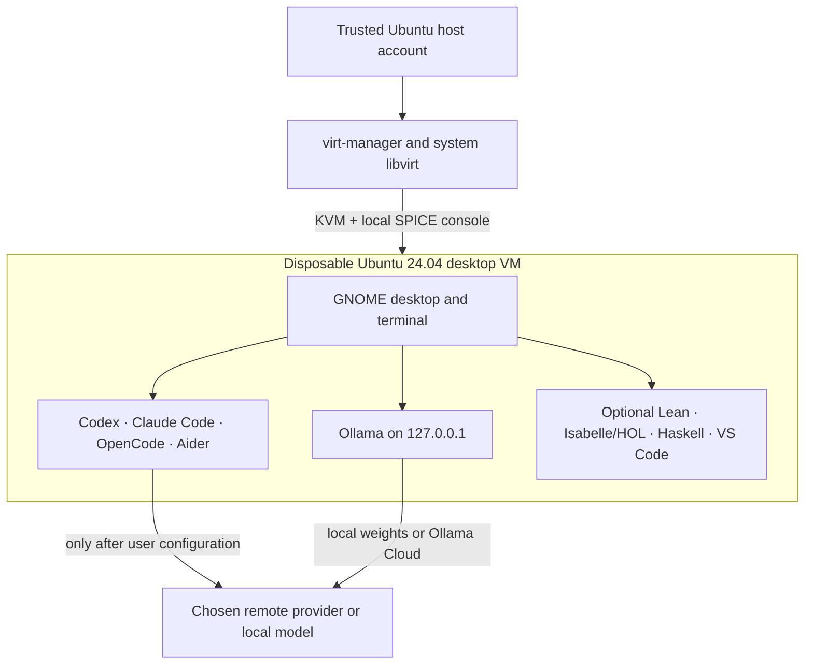

# KVM-Agent: a graphical Ubuntu VM for coding agents

[日本語版](README_jp.md)

> **Experimental, non-authoritative material.** This is a personal working
> project created partly with emerging AI tools. It is not a verified security
> product or professional advice. Test it without important data or credentials
> first. Corrections are welcome. Use it at your own risk and cost.
> [Full disclaimer](DISCLAIMER.md).

KVM-Agent creates a disposable graphical Ubuntu desktop for autonomous coding
agents. The host runs only Ubuntu's KVM/libvirt stack and `virt-manager`; Codex,
Claude Code, OpenCode, Aider, Ollama, project commands, and their third-party
installers run inside the VM.

The repository has one setup and recovery command:

```bash
./setup-kvm-agent.sh
```

The script installs the host virtualization stack, authenticates an official
Ubuntu cloud image, creates the VM, installs a minimal Ubuntu desktop, installs
the five requested tools, and waits for the result. Day-to-day operation happens
through the familiar `virt-manager` GUI.

An opt-in reduced formal-methods environment is available:

```bash
./setup-kvm-agent.sh --formal-methods
```

It adds Lean 4, Isabelle/HOL, GHC, Cabal, Haskell Language Server, HLint,
VS Code, and the official Lean and Haskell extensions inside the same
graphical guest. It does not restore the older repository architecture or its
larger prover collection.

The same command can resume interrupted finalization or replace a disposable
VM. A small removal helper remains available when removal without rebuilding
is wanted:

```bash
./setup-kvm-agent.sh --finalize-existing --name kvm-agent
./setup-kvm-agent.sh --replace-existing --name kvm-agent
./remove-kvm-agent.sh
```

It does not remove the shared verified Ubuntu image cache, host packages, or
additional disks that a user attached manually.

## Architecture



The GUI does not replace or bypass KVM: `virt-manager` is a graphical client
for the same system libvirt/KVM boundary. The host account remains trusted and
can control the VM. Coding agents are never installed on the host.

## What the script does

From the ordinary Ubuntu host account, the script:

1. installs KVM, libvirt, `virt-manager`, `virt-install`, and supporting Ubuntu
   packages with `sudo`;
2. adds that host account to the `libvirt` group;
3. starts libvirt's standard NAT network;
4. downloads Ubuntu 24.04's released amd64 cloud image and verifies it against
   Ubuntu's GPG-signed SHA-256 manifest;
5. asks for a local GUI password and creates a dedicated recovery SSH key;
6. creates a graphical VM with SPICE, virtio video, clipboard integration,
   an Ubuntu desktop, and no host directory share;
7. downloads and runs the official Codex, Claude Code, OpenCode, and Ollama
   installers inside the guest, and installs Aider in a per-user `uv`
   environment; and
8. when `--formal-methods` is selected, installs Lean through `elan`,
   Isabelle2025-2/HOL from its checksum-verified official Linux archive,
   GHC/Cabal/HLS through GHCup, HLint through Cabal, and VS Code with the
   official Lean and Haskell extensions;
9. before any vendor installer runs, configures a guest firewall that denies
   unsolicited inbound traffic and, by default, outbound traffic to private
   and link-local address ranges, while leaving internet access open; and
10. verifies each command, keeps Ollama bound to guest loopback
   (`127.0.0.1:11434`), disables future cloud-init runs, and destroys the
   cloud-init seed once provisioning is done.

It deliberately does **not**:

- install an agent, Node.js package, Python agent package, or Ollama on the host;
- sign in to OpenAI, Anthropic, GitHub, Ollama Cloud, or another service;
- download Ollama model weights;
- mount the host home directory or a project directory in the guest;
- configure USB passthrough, SSH-agent forwarding, or a LAN-facing VM console;
- choose a model provider; or
- install Agda, Rocq/OCaml, HOL4, HOL Light, Mathlib, or the Archive of Formal
  Proofs.

The reduced formal-methods environment remains optional, so users who only
need an agent VM do not pay its download, disk, and provisioning cost.

## Requirements

The supported primary path is:

| Component | Supported configuration |
|---|---|
| Host | Ubuntu 24.04 or 26.04 LTS, x86-64 |
| Guest | Ubuntu 24.04 LTS, amd64 |
| Firmware | Intel VT-x or AMD-V enabled |
| Host privilege | The invoking account can use `sudo` |
| Network | Internet access during initial provisioning |
| Display | Local graphical Ubuntu session for `virt-manager` |
| Disk | 120 GiB guest virtual disk by default; at least 12 GiB free on the host, or 30 GiB with `--formal-methods` |
| Memory | 8 GiB guest recommended; keep at least 2 GiB for the host |

The default memory is half of host RAM, clamped to 8–16 GiB. The default vCPU
count is half of the host CPUs, clamped to 2–8. A 16 GiB host therefore gets an
8 GiB VM, while a 32 GiB host gets a 16 GiB VM.

## Quick start

Download or clone this repository, then run:

```bash
cd kvm-agent
chmod +x setup-kvm-agent.sh
./setup-kvm-agent.sh
```

Do **not** run `sudo ./setup-kvm-agent.sh`. Run it as the host account that will
use `virt-manager`; the script invokes `sudo` only for the operations that need
it.

The script asks for a password for the guest's `agent` account. This password is
for the local graphical login. SSH password login remains disabled. The account
has passwordless sudo inside the disposable guest so the agents can be highly
autonomous without receiving host privilege.

Initial provisioning commonly takes 20–60 minutes. Installing the desktop,
upgrading Ubuntu, or reaching upstream download services may take longer on a
slow machine. With `--formal-methods`, the large Isabelle, Lean, GHC, HLS, and
VS Code downloads plus the HLint build may take **several hours**. The host
terminal waits by default and enforces a six-hour upper bound for that profile.

When the script finishes, log out of the Ubuntu **host** and back in if it added
your account to `libvirt` for the first time. Then run:

```bash
virt-manager --connect qemu:///system
```

Double-click `kvm-agent`, open its graphical console, and log in as `agent` with
the password chosen during setup. In the guest terminal:

```bash
codex
claude
opencode
aider
ollama --version
```

Each coding agent performs its own first-run authentication or provider setup.
Do that only after reading [Credential handling](docs/credentials.md).

With `--formal-methods`, the same guest also supports:

```bash
code
lean --version
lake --version
isabelle jedit
ghc --version
cabal --version
haskell-language-server-wrapper --version
hlint --version
```

See [Reduced formal-methods environment](docs/formal-methods.md) for the exact
scope, editor behavior, and update model.

## Options

```text
--name NAME        VM and host name (default: kvm-agent)
--user NAME        Guest login name (default: agent)
--memory MB        Guest RAM in MiB
--vcpus NUMBER     Guest virtual CPUs
--disk GB          Guest virtual disk size (default: 120)
--no-wait          Return after starting the VM
--allow-lan        Permit egress to private/link-local address ranges; UFW
                   remains enabled and continues to deny unsolicited inbound
                   traffic. Only for an internal mirror or model endpoint
--formal-methods   Add Lean, Isabelle/HOL, Haskell tooling, VS Code, and the
                   official Lean/Haskell extensions inside the guest
--replace-existing Remove the selected existing VM after exact-name
                   confirmation, then build it again
--finalize-existing
                   Resume verified final cleanup of an existing VM
```

The 120 GiB default is a guest-visible maximum, not 120 GiB allocated
immediately on the host: qcow2 grows as the guest writes data. Before any
large installation, setup explicitly grows and verifies the root partition
and filesystem. It also keeps 512 MiB of emergency space during provisioning
so a failed download or package build can release that space instead of
leaving the graphical login unusable. The host must have at least 12 GiB free
for the base profile or 30 GiB for `--formal-methods`; setup checks this before
`--replace-existing` removes the old VM.

Large installers and archives, including the Isabelle distribution, are staged
in a protected directory on the guest root filesystem. They are not stored in
Ubuntu's RAM-backed `/run` filesystem, and partial downloads are removed
automatically on failure.

`--no-wait` returns before provisioning finishes, so it cannot immediately
remove the cloud-init seed or disable future cloud-init runs. Complete those
steps later with the repository helper; it waits for successful provisioning,
performs a required update reboot, rediscovers a changed DHCP address, verifies
the guest marker, disables cloud-init, and removes the seed:

```bash
./setup-kvm-agent.sh --finalize-existing --name NAME
```

For example:

```bash
./setup-kvm-agent.sh \
  --name agent-project-01 \
  --memory 16384 \
  --vcpus 8 \
  --formal-methods
```

VM names use lowercase letters, numbers, and hyphens. By default, the script
refuses to replace an existing libvirt domain or disk. `--replace-existing`
shows the exact removal plan, requires the VM name to be typed, retains the
shared Ubuntu cache and any manually attached extra disks, then rebuilds.

## Resume interrupted finalization

If setup reports that the guest did not become reachable after its update
reboot, but the desktop and tools work, do not recreate the VM and do not type
the individual SSH and `virsh` cleanup commands. Run:

```bash
./setup-kvm-agent.sh --finalize-existing --name kvm-agent
```

The helper re-queries libvirt DHCP leases instead of trusting the pre-reboot
address. It verifies `/var/lib/kvm-agent/provisioned` through the recovery key
before changing cloud-init or touching the seed, and verifies both the running
and persistent device configurations before deleting the exact managed seed
file. SSH and cloud-init checks are polled without `cloud-init status --wait`;
each SSH invocation has a hard deadline, so a connected but blocked guest
cannot make the helper hang indefinitely. It is also the supported completion
path after `--no-wait`.

## Completely remove a VM

Shut the guest down normally, then run:

```bash
./remove-kvm-agent.sh --name kvm-agent
```

The helper displays the libvirt domain, attached storage, exact managed image
paths, recovery SSH directory, and log it will remove. Type the exact VM name
to confirm. It removes the domain, its main disk, any leftover cloud-init seed,
and its host-side recovery data. It retains the verified Ubuntu base-image
cache and virtualization packages, so a later rebuild does not repeat the
host installation or image download.

Use `--dry-run` to inspect the plan. The helper refuses to remove a running VM;
shut it down first, or use `--force` only when accepting the same filesystem
corruption risk as pulling a physical machine's power cable. Extra storage
attached manually is reported but never deleted automatically.

## Daily use

Use `virt-manager` to start, stop, pause, clone, snapshot, resize, and view the
guest. Full-screen mode makes it feel like an ordinary second Ubuntu machine.
The VM is not configured to start automatically with the host.

A good working cycle is:

1. create or restore a clean snapshot;
2. place only the project data and revocable credentials needed for this task
   in the guest;
3. run the agent and review its commits or patch;
4. export the reviewed result; and
5. discard with `remove-kvm-agent.sh`, or roll back the VM, when its state is
   no longer trusted.

See [Daily operation](docs/daily-use.md) for snapshots, updates, SSH recovery,
and data transfer.

## Important security limits

KVM sharply reduces the consequences of an agent mistake, but it is not a proof
of safety. A compromised guest can read everything placed in that guest, use
its network connection and provider credentials, attack the hypervisor, and
present malicious text or clipboard content to the host user.

The default VM has outbound internet access because provisioning and remote
model providers require it. It has no port forwarded from the LAN, and its own
firewall blocks private and link-local destination ranges. This normally covers
the libvirt host, other guests, and a physical LAN; locally routed public
addresses are not covered. The host can still reach the guest on libvirt's
private network. That firewall lives inside the guest, so an agent with sudo
can remove it — see
[SECURITY.md](SECURITY.md) for what is enforced outside the guest and what is
only a default. The SPICE console has no TCP listener; `virt-manager` reaches it
through libvirt. SPICE clipboard integration is enabled for usability, so do not
move secrets through the clipboard.

The host account that runs `virt-manager` holds `libvirt` group membership,
which is equivalent to host root. On Ubuntu that authority is ambient and cannot
be downgraded to a per-session prompt without reconfiguring libvirt's socket
authentication, so prefer a dedicated VM host over a machine that is also your
browsing and mail workstation. See [SECURITY.md](SECURITY.md).

The installer URLs intentionally follow the current official release channels.
That makes the one-script workflow maintainable but not bit-for-bit
reproducible. Those installers still run only inside an empty, credential-free
guest. Organizations that require exact artifact review should replace the
moving installers with an internally approved golden image or pinned bundle.

Read [SECURITY.md](SECURITY.md) before adding confidential source code,
long-lived keys, production data, or expensive API credentials.

## Documentation

- [Security policy and threat model](SECURITY.md)
- [Design and trust boundaries](docs/design.md)
- [Daily operation](docs/daily-use.md)
- [Credential handling](docs/credentials.md)
- [Agent tools and model services](docs/agent-tools-and-model-services.md)
- [Reduced formal-methods environment](docs/formal-methods.md)
- [Troubleshooting](docs/troubleshooting.md)
- [Primary upstream references](docs/references.md)
- [Disclaimer](DISCLAIMER.md)

## Status

This is an experimental reference implementation, not an independently audited
security product. The script has static and mocked workflow tests in this
repository; creating a real VM still depends on host firmware, Ubuntu mirrors,
libvirt, and moving third-party installers. Report failures with the host
release, script options, `cloud-init status --long`, and the relevant tail of
`/var/log/kvm-agent-provision.log`.
