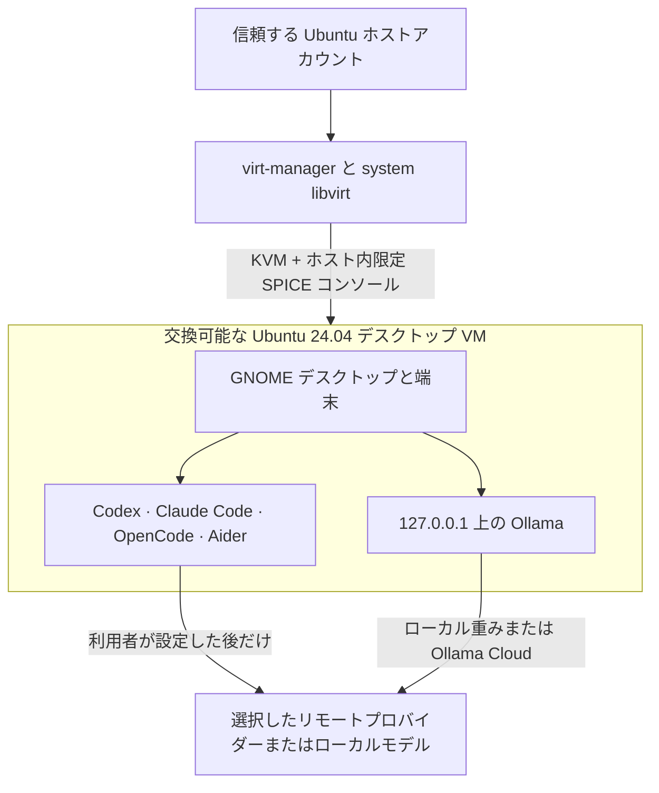

# KVM-Agent：コーディングエージェント用の GUI 付き Ubuntu VM

[English](README.md)

> **実験的で非公式な資料です。** これは、新しい AI ツールも一部利用して
> 作成した個人的な作業プロジェクトです。検証済みのセキュリティ製品でも
> 専門的助言でもありません。まず重要なデータや認証情報を入れずに試して
> ください。訂正を歓迎します。自己の責任と費用で使用してください。
> [免責事項全文](DISCLAIMER_jp.md)。

KVM-Agent は、自律的コーディングエージェントを動かすための交換可能な
GUI 付き Ubuntu デスクトップを作ります。ホストで動かすのは Ubuntu の
KVM/libvirt と `virt-manager` だけです。Codex、Claude Code、OpenCode、
Aider、Ollama、プロジェクトのコマンド、および第三者インストーラーは
VM 内で動きます。

現在のリポジトリでは、プロビジョニング用スクリプトは一つだけです。

```bash
./setup-kvm-agent.sh
```

このスクリプトがホストの仮想化環境を導入し、Ubuntu 公式イメージを認証し、
VM を作り、最小 Ubuntu デスクトップと要求された五つのツールを導入して、
完了まで待ちます。日常的な操作には使い慣れた `virt-manager` の GUI を
使います。

## アーキテクチャ



GUI は KVM を置き換えたり迂回したりしません。`virt-manager` は同じ
system libvirt/KVM 境界を操作する GUI クライアントです。ホストアカウントは
引き続き信頼主体であり、VM を完全に制御できます。コーディングエージェントを
ホストへ導入することはありません。

## スクリプトが行うこと

通常の Ubuntu ホストアカウントから実行すると、スクリプトは次を行います。

1. KVM、libvirt、`virt-manager`、`virt-install` と補助 Ubuntu パッケージを
   `sudo` で導入する。
2. そのホストアカウントを `libvirt` グループへ追加する。
3. libvirt の標準 NAT ネットワークを起動する。
4. Ubuntu 24.04 のリリース版 amd64 クラウドイメージをダウンロードし、
   Ubuntu が GPG 署名した SHA-256 一覧に対して検証する。
5. ローカル GUI 用パスワードを尋ね、専用の復旧 SSH 鍵を作る。
6. SPICE、virtio video、クリップボード連携、Ubuntu デスクトップを持ち、
   ホストディレクトリを共有しない GUI 付き VM を作る。
7. Codex、Claude Code、OpenCode、Ollama の公式インストーラーをゲスト内で
   ダウンロード・実行し、Aider を利用者専用 `uv` 環境へ導入する。
8. ベンダー installer を実行する前に、未要求の inbound 通信と、既定では
   private・link-local address range への outbound 通信を拒否する guest firewall を
   構成する（インターネット接続は開いたまま）。
9. 各コマンドを検証し、Ollama をゲストのループバック
   (`127.0.0.1:11434`) に限定し、将来の cloud-init 実行を無効化してから、
   プロビジョニング完了後に cloud-init seed を破棄する。

次のことは意図的に**行いません**。

- ホストへエージェント、Node.js パッケージ、Python エージェントパッケージ、
  Ollama を導入する。
- OpenAI、Anthropic、GitHub、Ollama Cloud その他へログインする。
- Ollama のモデル重みをダウンロードする。
- ホストのホームやプロジェクトディレクトリをゲストへマウントする。
- USB パススルー、SSH agent forwarding、LAN 公開 VM コンソールを設定する。
- モデルプロバイダーを選ぶ。
- 以前の `formal_methods` プロファイルを導入する。

形式手法ツールはプロジェクト固有なので、必要な VM の中へ個別に導入できます。
エージェント環境だけが必要な利用者は、その保守・プロビジョニング費用を負わなく
なりました。

## 必要条件

主要対応経路は次のとおりです。

| 構成要素 | 対応構成 |
|---|---|
| ホスト | Ubuntu 24.04 または 26.04 LTS、x86-64 |
| ゲスト | Ubuntu 24.04 LTS、amd64 |
| ファームウェア | Intel VT-x または AMD-V が有効 |
| ホスト権限 | 実行アカウントが `sudo` を利用可能 |
| ネットワーク | 初回プロビジョニング中にインターネット接続 |
| 表示 | `virt-manager` 用のローカル GUI Ubuntu セッション |
| ディスク | 50 GiB 以上の空き。80 GiB 以上を推奨 |
| メモリ | ゲスト 8 GiB を推奨。ホストへ 2 GiB 以上残す |

既定メモリはホスト RAM の半分を 8～16 GiB の範囲に収めた値です。既定
vCPU 数はホスト CPU 数の半分を 2～8 の範囲に収めた値です。そのため、
16 GiB ホストには 8 GiB、32 GiB ホストには 16 GiB の VM が割り当てられます。

## クイックスタート

このリポジトリをダウンロードまたは clone し、次を実行します。

```bash
cd kvm-agent
chmod +x setup-kvm-agent.sh
./setup-kvm-agent.sh
```

`sudo ./setup-kvm-agent.sh` として実行しては**いけません**。`virt-manager` を
使うホストアカウントから実行してください。必要な操作だけスクリプト内部で
`sudo` を呼びます。

ゲストの `agent` アカウント用パスワードを尋ねられます。これはローカル GUI
ログイン用です。SSH のパスワードログインは無効のままです。交換可能なゲスト
内ではこのアカウントにパスワードなし sudo を与えるため、エージェントは
ホスト権限を得ずに高い自律性を持てます。

初回プロビジョニングは通常 20～60 分かかります。遅いマシンではデスクトップ
導入、Ubuntu 更新、上流ダウンロードにさらに時間がかかる場合があります。
端末には現在の段階が表示され、既定では完了まで待ちます。

スクリプト完了後、そのホストアカウントが初めて `libvirt` に追加された
場合は、Ubuntu **ホスト**から一度ログアウトして再ログインします。その後、
次を実行します。

```bash
virt-manager --connect qemu:///system
```

`kvm-agent` をダブルクリックして GUI コンソールを開き、設定時に選んだ
パスワードで `agent` としてログインします。ゲスト端末では次を実行できます。

```bash
codex
claude
opencode
aider
ollama --version
```

各コーディングエージェントは、初回起動時に独自の認証またはプロバイダー設定を
行います。その前に[認証情報の取り扱い](docs/credentials_jp.md)を読んでください。

## オプション

```text
--name NAME        VM とホスト名（既定: kvm-agent）
--user NAME        ゲストのログイン名（既定: agent）
--memory MB        ゲスト RAM（MiB）
--vcpus NUMBER     ゲスト仮想 CPU 数
--disk GB          ゲスト仮想ディスク容量（既定: 80）
--no-wait          VM 起動後、完了を待たずに戻る
--allow-lan        private・link-local address range への外向き通信を許可する。
                   UFW は有効なままで、未要求の inbound 通信は引き続き拒否する。
                   社内ミラーやモデル endpoint が必要な場合のみ
```

`--no-wait` はプロビジョニング完了前に戻るため、この経路ではゲストパスワードの
hash を含む cloud-init seed が削除されず、将来の cloud-init 実行も無効化されません。
provisioning marker が作られた後、guest 内で
`sudo install -o root -g root -m 0644 /dev/null /etc/cloud/cloud-init.disabled`
を実行してください。VM が落ち着いた後、
virt-manager で seed を eject してから
`/var/lib/libvirt/images/kvm-agent/vms/NAME-seed.img` を手動で削除してください。

例:

```bash
./setup-kvm-agent.sh \
  --name agent-project-01 \
  --memory 16384 \
  --vcpus 8 \
  --disk 120
```

VM 名には小文字英字、数字、ハイフンを使います。既存の libvirt domain や
ディスクを置き換えることは拒否します。

## 日常的な利用

`virt-manager` からゲストの起動、停止、一時停止、clone、snapshot、容量調整、
画面表示を行います。全画面表示にすれば、通常のもう一台の Ubuntu マシンの
ように利用できます。VM はホスト起動時に自動起動する設定ではありません。

推奨する作業サイクル:

1. クリーンな snapshot を作るか復元する。
2. この作業に必要なプロジェクトデータと失効可能な認証情報だけをゲストへ入れる。
3. エージェントを実行し、commit または patch をレビューする。
4. レビュー済み結果を外へ出す。
5. VM の状態を信頼できなくなったら破棄または rollback する。

snapshot、更新、復旧 SSH、データ移動については
[日常運用](docs/daily-use_jp.md)を参照してください。

## 重要なセキュリティ上の限界

KVM はエージェントの誤動作による影響を大幅に減らしますが、安全性の証明では
ありません。侵害されたゲストは、そのゲストへ入れた全データを読み、ネット接続と
プロバイダー認証情報を利用し、ハイパーバイザーを攻撃し、悪意ある文字列や
クリップボード内容をホスト利用者へ提示できます。

既定 VM は、プロビジョニングとリモートモデル利用のため外向きインターネット接続を
持ちます。LAN から VM への port forward はなく、ゲスト側 firewall は private・
link-local destination range への通信を遮断します。通常は libvirt host、他 guest、
物理 LAN を含みますが、local に route された public address は対象外です。host から
libvirt の private network 上で guest へ到達することは引き続き可能です。この
firewall は guest 内部にあるため、
sudo を持つエージェントは解除できます。ゲスト外で強制される項目とゲスト内の既定
にすぎない項目の区別は [SECURITY_jp.md](SECURITY_jp.md) を参照してください。
SPICE には TCP listener がなく、`virt-manager` は libvirt 経由で接続します。
利便性のため SPICE クリップボード連携を有効にしているので、クリップボードで
秘密情報を移動しないでください。

`virt-manager` を実行するホストアカウントは `libvirt` グループに属し、これは
host root と同等です。Ubuntu ではこの権限は常時有効で、libvirt の socket 認証を
再構成しない限り session ごとの認証へ下げられません。日常のブラウジングやメールに
使う machine ではなく、専用の VM host を用意することを推奨します。
[SECURITY_jp.md](SECURITY_jp.md) を参照してください。

インストーラー URL は現在の公式 release channel を意図的に追随します。これにより
単一スクリプトを保守しやすくする一方、bit-for-bit の再現性はありません。これらの
インストーラーも、空で認証情報のないゲスト内でだけ実行します。成果物を厳密に
レビューする必要がある組織では、移動するインストーラーを内部承認済み golden
image または pin 済み bundle に置き換えてください。

機密ソース、長期鍵、本番データ、高額 API 認証情報を入れる前に
[SECURITY_jp.md](SECURITY_jp.md)を読んでください。

## 文書

- [セキュリティポリシーと脅威モデル](SECURITY_jp.md)
- [設計と信頼境界](docs/design_jp.md)
- [日常運用](docs/daily-use_jp.md)
- [認証情報の取り扱い](docs/credentials_jp.md)
- [エージェントツールとモデルサービス](docs/agent-tools-and-model-services_jp.md)
- [トラブルシューティング](docs/troubleshooting_jp.md)
- [上流の一次資料](docs/references_jp.md)
- [免責事項](DISCLAIMER_jp.md)

## 状態

これは実験的な参照実装であり、独立監査済みのセキュリティ製品ではありません。
リポジトリでは script の静的検査と mock workflow test を行っていますが、実 VM
作成はホストの firmware、Ubuntu mirror、libvirt、更新される第三者
installer に依存します。問題を報告する際は、ホスト release、script option、
`cloud-init status --long`、および `/var/log/kvm-agent-provision.log` の
関連末尾を添えてください。
