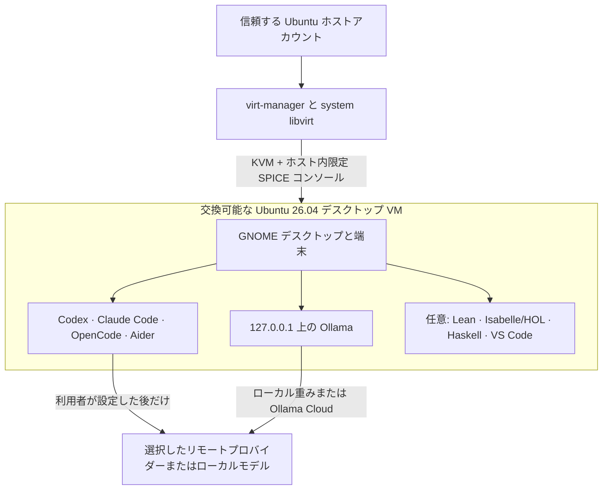

# KVM-Agent：コーディングエージェント用の GUI 付き Ubuntu VM

[English](README.md)

> **実験的で非公式な資料です。** これは、新しい AI ツールも一部利用して
> 作成した個人的な作業プロジェクトです。検証済みのセキュリティ製品でも
> 専門的助言でもありません。まず重要なデータや認証情報を入れずに試して
> ください。訂正を歓迎します。自己の責任と費用で使用してください。
> [免責事項全文](DISCLAIMER_jp.md)。

KVM-Agent は、自律的コーディングエージェントを動かすための交換可能な
GUI 付き Ubuntu デスクトップを作ります。ホストで動かすのは Ubuntu の
KVM/libvirt と `virt-manager` だけです。Codex、Claude Code、OpenCode、
Aider、Ollama、プロジェクトのコマンド、および第三者インストーラーは
VM 内で動きます。

現在のリポジトリでは、setup と recovery のコマンドは一つだけです。

```bash
./setup-kvm-agent.sh
```

このスクリプトがホストの仮想化環境を導入し、Ubuntu 公式イメージを認証し、
VM を作り、最小 Ubuntu デスクトップ、要求された五つのツール、current 公式
GitHub CLI を導入して完了まで待ちます。日常的な操作には使い慣れた
`virt-manager` の GUI を使います。

縮小した形式手法環境は opt-in で追加できます。

```bash
./setup-kvm-agent.sh --formal-methods
```

同じ GUI 付き guest 内へ Lean 4、Isabelle/HOL、GHC、Cabal、Haskell Language
Server、HLint、VS Code、および公式 Lean/Haskell extension だけを追加します。
旧 repository の architecture や大きな prover collection は復活させません。

さらに、異なる物理 host 上の VM 間で長時間 job を送る manager/worker profile も
opt-in で利用できます。Tailscale または WireGuard と通常の OpenSSH を使います。
通常利用者向けには有効化しません。詳細は
[cross-host manager/worker VM](docs/swarm_jp.md)を参照してください。

同じコマンドで、中断した finalization の再開や使い捨て VM の置換もできます。
再作成せず削除だけを行う小さな helper も残しています。

```bash
./setup-kvm-agent.sh --finalize-existing --name kvm-agent
./setup-kvm-agent.sh --replace-existing --name kvm-agent
./setup-kvm-agent.sh --resize-existing --name kvm-agent --memory 24576 --vcpus 12
./remove-kvm-agent.sh
```

共有の検証済み Ubuntu image cache、host package、利用者が後から接続した
追加 disk は削除しません。

## アーキテクチャ



GUI は KVM を置き換えたり迂回したりしません。`virt-manager` は同じ
system libvirt/KVM 境界を操作する GUI クライアントです。ホストアカウントは
引き続き信頼主体であり、VM を完全に制御できます。コーディングエージェントを
ホストへ導入することはありません。

## コマンドで使う名前

同じ VM に対し、複数の仕組みがそれぞれ identifier を持ちます。技術的には独立ですが、
一台の machine に別々の名前を使うと運用ミスの原因になります。**一意な VM 名を一つ決め、
libvirt 名、guest hostname、Tailscale device 名、Mac SSH alias で同じ名前を使うことを
推奨します。**

| 名前 | 推奨例 | 使用箇所 |
|---|---|---|
| libvirt VM 名兼 guest hostname | `vm-workstation-01` | `--name`、`virsh`、`kvm-agent-host` |
| Tailscale device 名 | `vm-workstation-01` | MagicDNS、Machines page |
| Mac の SSH alias | `vm-workstation-01` | macOS の `ssh`、`scp` |
| guest login 名 | `agent` | Linux、OpenSSH |
| Tailscale tag | `tag:development` または swarm 複合 tag | Access policy。machine identity ではなく trust/role を表す |

物理 host の通称は別物です。Tailscale tag も machine 名の代わりではなく、security role
や group を表すものとして扱います。複数 machine を接続する前に
[安全なリモートアクセス](docs/remote-access_jp.md#どの名前が何を表すか)を参照してください。

## スクリプトが行うこと

通常の Ubuntu ホストアカウントから実行すると、スクリプトは次を行います。

1. KVM、libvirt、`virt-manager`、`virt-install` と補助 Ubuntu パッケージを
   `sudo` で導入する。
2. そのホストアカウントを `libvirt` グループへ追加する。
3. libvirt の標準 NAT ネットワークを起動する。
4. Ubuntu 26.04 のリリース版 amd64 クラウドイメージをダウンロードし、
   Ubuntu が GPG 署名した SHA-256 一覧に対して検証する。
5. ローカル GUI 用パスワードを尋ね、専用の復旧 SSH 鍵を作る。
6. SPICE、virtio video、クリップボード連携、Ubuntu デスクトップを持ち、
   ホストディレクトリを共有しない GUI 付き VM を作る。
7. GitHub CLI を GitHub の公式 APT repository から導入し、Codex、Claude Code、
   OpenCode、Ollama の公式インストーラーをゲスト内でダウンロード・実行し、
   Aider を利用者専用 `uv` 環境へ導入する。
8. `--formal-methods` を選んだ場合、Lean を `elan` から、
   Isabelle2025-2/HOL を checksum 検証した公式 Linux archive から、
   GHC/Cabal/HLS を GHCup から、HLint を Cabal から導入し、さらに VS Code と
   公式 Lean/Haskell extension を導入する。
9. `--swarm-role` を選んだ場合、Tailscale または WireGuard support、manager
   専用 SSH key、password lock 済み non-sudo worker account に加え、安全な Tailscale
   naming、host-key 検証、固定 SSH/rsync access、remote-job lifecycle 用 helper を追加する。
   Tailscale authentication と manager-key authorization は人間が明示的に行う。
10. host 側の `kvm-agent-host` helper、guest 側の controller-key helper、および
   password、root、agent、X11、tunnel、port forwarding を既定で拒否する
   OpenSSH baseline を導入する。
11. ベンダー installer を実行する前に、未要求の inbound 通信と、既定では
   private・link-local address range への outbound 通信を拒否する guest firewall を
   構成する（インターネット接続は開いたまま）。
12. 各コマンドを検証し、Ollama をゲストのループバック
   (`127.0.0.1:11434`) に限定し、将来の cloud-init 実行を無効化してから、
   プロビジョニング完了後に cloud-init seed を破棄する。

次のことは意図的に**行いません**。

- ホストへエージェント、Node.js パッケージ、Python エージェントパッケージ、
  Ollama を導入する。
- OpenAI、Anthropic、GitHub、Ollama Cloud その他へログインする。
- Ollama のモデル重みをダウンロードする。
- ホストのホームやプロジェクトディレクトリをゲストへマウントする。
- USB パススルー、SSH agent forwarding、LAN 公開 VM コンソールを設定する。
- VM を Tailscale へ enroll する、WireGuard peer を自動構成する、物理 host を
  swarm overlay に参加させる。
- モデルプロバイダーを選ぶ。
- Agda、Rocq/OCaml、HOL4、HOL Light、Mathlib、Archive of Formal Proofs を
  導入する。

縮小形式手法環境は任意なので、エージェント環境だけが必要な利用者は、その
download、disk、provisioning 費用を負いません。

## 必要条件

主要対応経路は次のとおりです。

| 構成要素 | 対応構成 |
|---|---|
| ホスト | Ubuntu 24.04 または 26.04 LTS、x86-64 |
| ゲスト | Ubuntu 26.04 LTS、amd64 |
| ファームウェア | Intel VT-x または AMD-V が有効 |
| ホスト権限 | 実行アカウントが `sudo` を利用可能 |
| ネットワーク | 初回プロビジョニング中にインターネット接続 |
| 表示 | `virt-manager` 用のローカル GUI Ubuntu セッション |
| ディスク | Guest 仮想 disk は既定 120 GiB。Host 空きは最低 12 GiB、`--formal-methods` では 30 GiB |
| メモリ | Host RAM の 75% を自動割当（上限 32 GiB、host に最低 2 GiB を確保）。快適な利用には 8 GiB 以上を推奨 |

既定 memory は host RAM の 75% で、上限 32 GiB、かつ host に最低 2 GiB を
残します。既定 vCPU は host logical CPU の 75% で、上限 16 です。例えば
16 GiB/8-thread host では通常約 12 GiB・6 vCPU、64 GiB/32-thread host では
32 GiB・16 vCPU になります。`--memory` と `--vcpus` の明示値は引き続き優先されます。

## ゲスト release の保証

新規 VM は Ubuntu 公式リリース版
`ubuntu-26.04-server-cloudimg-amd64.img` から作成します。Setup は署名済み image
manifest を検証し、guest provisioning の最初に `26.04` を照合し、さらに管理対象の
復旧 channel から `/etc/os-release` を再確認します。Guest が Ubuntu 26.04 を報告しない
場合、最終 cleanup を拒否します。確認済み release は
`/var/lib/kvm-agent/installed-versions.txt` にも記録します。

Ubuntu 24.04 host の一部では、`libosinfo` database が `ubuntu26.04` identifier より
古いことがあります。その場合、script は `virt-install` の互換
**仮想 hardware metadata** としてだけ `ubuntu24.04` を使うと明示します。これは
Ubuntu 24.04 を選択・導入する指定ではありません。Disk URL、署名済み checksum、
guest 内の初期確認と最終確認はすべて 26.04 に固定されたままです。

Repository を更新しても、作成済み VM の OS は変わりません。信頼する Ubuntu host
から次で確認できます。

```bash
kvm-agent-host ssh YOUR_VM_NAME cat /etc/os-release
```

24.04 と表示された場合、残したい作業を VM 外へコピーし、内容を確認してから
`--replace-existing` を使います。この option は選択した guest を意図的に削除して
再作成します。[トラブルシューティング](docs/troubleshooting_jp.md#既存-guest-が-ubuntu-2404)
の保護付き移行手順に従ってください。

## クイックスタート

このリポジトリをダウンロードまたは clone し、次を実行します。

```bash
cd YOUR_AGENT_VM_DIRECTORY
chmod +x setup-kvm-agent.sh
./setup-kvm-agent.sh
```

`YOUR_AGENT_VM_DIRECTORY` は置き換える名前です。Git clone なら通常 `agent-vm`、
ZIP download なら `agent-vm-main` などの名前で展開されます。

`sudo ./setup-kvm-agent.sh` として実行しては**いけません**。`virt-manager` を
使うホストアカウントから実行してください。必要な操作だけスクリプト内部で
`sudo` を呼びます。

ゲストの `agent` アカウント用パスワードを尋ねられます。これはローカル GUI
ログイン用です。SSH のパスワードログインは無効のままです。交換可能なゲスト
内ではこのアカウントにパスワードなし sudo を与えるため、エージェントは
ホスト権限を得ずに高い自律性を持てます。

初回プロビジョニングは通常 20～60 分かかります。遅いマシンではデスクトップ
導入、Ubuntu 更新、上流ダウンロードにさらに時間がかかる場合があります。
`--formal-methods` では Isabelle、Lean、GHC、HLS、VS Code の大きな download と
HLint build のため、**数時間かかる場合があります**。Host terminal は既定で
待機し、この profile には 6 時間の上限を設けます。

スクリプト完了後、そのホストアカウントが初めて `libvirt` に追加された
場合は、Ubuntu **ホスト**から一度ログアウトして再ログインします。その後、
次を実行します。

```bash
virt-manager --connect qemu:///system
```

`kvm-agent` をダブルクリックして GUI コンソールを開き、設定時に選んだ
パスワードで `agent` としてログインします。ゲスト端末では次を実行できます。

```bash
codex
claude
opencode
aider
ollama --version
gh --version
```

各コーディングエージェントは、初回起動時に独自の認証またはプロバイダー設定を
行います。その前に[認証情報の取り扱い](docs/credentials_jp.md)を読んでください。
Private repository、protected `main`、project-scoped deploy key、fine-grained API token、
issue-to-pull-request 運用は
[local coding-agent VM の GitHub integration](docs/github-integration_jp.md)に従ってください。

`--formal-methods` を指定した guest では次も使えます。

```bash
code
lean --version
lake --version
isabelle jedit
ghc --version
cabal --version
haskell-language-server-wrapper --version
hlint --version
```

正確な対象、editor の扱い、update model は
[縮小形式手法環境](docs/formal-methods_jp.md)を参照してください。

## オプション

```text
--name NAME        libvirt VM 名兼 guest Linux hostname
                   （新規 VM のみ既定: kvm-agent）
--user NAME        ゲストのログイン名（既定: agent）
--memory MB        ゲスト RAM（MiB）
--vcpus NUMBER     ゲスト仮想 CPU 数
--disk GB          ゲスト仮想ディスク容量（既定: 120）
--no-wait          VM 起動後、完了を待たずに戻る
--allow-lan        private・link-local address range への外向き通信を許可する。
                   UFW は有効なままで、未要求の inbound 通信は引き続き拒否する。
                   社内ミラーやモデル endpoint が必要な場合のみ
--formal-methods   guest 内へ Lean、Isabelle/HOL、Haskell tool、VS Code、
                   公式 Lean/Haskell extension を追加する
--allow-remote-editor
                   remote editor 用に client 発の local SSH forwarding を許可する。
                   agent forwarding と X11 forwarding は無効のまま
--swarm-role ROLE  guest を "manager"、"worker"、または "both" として準備する
--swarm-network N  swarm 通信に "tailscale"（既定）または "wireguard" を使う
--add-swarm ROLE   provisioning 済みの管理対象 VM に swarm role を追加する
--add-journal      既存の管理対象 VM に自動 research journal を追加する
--harden-existing  指定した既存 VM に現在の SSH baseline を再適用する
--journal-project P
                   guest 内の Git project P を初期化する。複数回指定可能
--journal-backend B
                   evidence（既定）、claude、codex のいずれか
--journal-allow-remote-reporting
                   長さ制限済み project metadata の provider 送信に同意する。
                   claude/codex backend では必須
--journal-timezone Z
                   IANA timezone Z（既定: Etc/UTC）
--resize-existing  powered-off の既存 VM を削除せず、永続 RAM/vCPU 割当を変更する
--replace-existing 指定した既存 VM を正確な名前の確認後に削除し、再作成する
--finalize-existing
                   既存 VM の検証済み最終 cleanup を再開する
```

既定の 120 GiB は guest から見える上限であり、host 上で直ちに 120 GiB を
確保する意味ではありません。qcow2 は guest の書き込みに応じて増えます。
大容量導入の前に setup は root partition と filesystem を明示的に拡張し、
要求容量を使えることを検証します。また provisioning 中は 512 MiB の緊急用
空き領域を確保し、download や package build の失敗時にはそれを解放して、
容量不足で GUI login まで不能になる事態を避けます。Host には基本 profile で
最低 12 GiB、`--formal-methods` で最低 30 GiB の空きが必要であり、
`--replace-existing` が旧 VM を削除する前に確認します。

Isabelle 配布物を含む大きな installer と archive は、guest の root filesystem
上にある保護された directory へ一時保存します。Ubuntu の RAM-backed `/run`
には保存せず、失敗時には途中までの download も自動的に削除します。

`--no-wait` は provisioning 完了前に戻るため、その時点では cloud-init seed の
削除や将来の cloud-init 実行の無効化はできません。後で repository の helper を
実行してください。Helper は provisioning 成功と guest marker を検証し、cloud-init
を無効化してから必要な update reboot を行い、新しい boot の完了を確認し、変更された
DHCP address を再検出して seed を削除します。

```bash
./setup-kvm-agent.sh --finalize-existing --name NAME
```

例:

```bash
./setup-kvm-agent.sh \
  --name agent-project-01 \
  --memory 16384 \
  --vcpus 8 \
  --formal-methods
```

VM 名には小文字英字、数字、ハイフンを使います。既定では既存の libvirt
domain や disk の置換を拒否します。`--replace-existing` は削除計画を表示し、
VM 名の手入力を要求し、共有 Ubuntu cache と手動で追加した disk を残して
から再作成します。

## 再作成せず RAM・vCPU を変更する

既存 VM を通常どおり shutdown し、host 上で次を実行します。

```bash
./setup-kvm-agent.sh --resize-existing \
  --name kvm-agent \
  --memory 24576 \
  --vcpus 12
```

この操作は libvirt domain の永続 RAM・vCPU 設定だけを変更します。仮想 disk、
guest filesystem、snapshot、guest 内の data は削除しません。VM が実行中の場合、または
managed-save image がある場合は拒否します。virt-manager/libvirt が running state を保存
している場合は、まず VM を起動して通常の full shutdown を行ってください。古い saved
state が以前の resource configuration を復元することを防ぎます。memory または vCPU の
一方だけを指定することもできます。

```bash
./setup-kvm-agent.sh --resize-existing --name kvm-agent --memory 32768
./setup-kvm-agent.sh --resize-existing --name kvm-agent --vcpus 16
```

変更後に VM を起動すると新しい割当が有効になります。Guest OS と workload が
新しい CPU 数を認識する通常の cold boot を使うため、live hot-plug には依存しません。

## 任意の cross-host manager/worker VM

大多数の利用者はこの機能を無視できます。初回は
`--swarm-role manager|worker|both`、後からは `--add-swarm` で role を追加できます。
これらの role は VM を改名しないため、異なる host 上の VM は両方とも既定名
`kvm-agent` のままで構いません。既定は Tailscale、raw WireGuard も選択可能です。
Provisioning は device enrollment や peer authorization を自動化しません。
Directional access と risk の説明を含む
[cross-host manager/worker VM](docs/swarm_jp.md)を有効化前に読んでください。

## 既存 VM の自動 research journal

Provisioning 済みで起動中の VM に、物理 host から後付けできます。

```bash
./setup-kvm-agent.sh \
  --add-journal \
  --name kvm-agent \
  --journal-project /home/agent/YOUR_PROJECT
```

`YOUR_PROJECT` は置き換える名前で、project path は guest 内の path です。
同じ VM の複数 repository には
`--journal-project` を繰り返します。VM は再作成しません。Agent-neutral な event
instruction、canonical JSON と static HTML report、07:00 daily、土曜 weekly、毎月1日の
persistent timer を追加します。安全な既定値は model provider へ data を送らない deterministic
evidence-only report です。Claude/Codex enrichment は別の consent flag を必要とする opt-in
で、失敗時は evidence-only へ fallback します。OpenCode agent も event は記録できますが、
unattended reporter には使いません。Layout、event command、
security boundary、backend の詳細は
[自動 research journal](docs/journal_jp.md)を参照してください。

## 中断した finalization を再開する

Setup が update reboot 後に guest へ到達できなかったと報告しても、desktop と
各 tool が動作する場合は、VM を作り直したり SSH・`virsh` の個別 cleanup command
を手入力したりしないでください。次を実行します。

```bash
./setup-kvm-agent.sh --finalize-existing --name kvm-agent
```

Recovery key で `/var/lib/kvm-agent/provisioned` を確認するまで cloud-init や seed
を変更しません。確認後、update reboot を要求する前に cloud-init disable marker を
作成・検証します。`systemctl reboot` は非同期なので、SSH 接続成功だけを reboot 完了
とは見なしません。Kernel boot ID が変わるまで待ち、reboot 前の address を信用せず
libvirt の DHCP lease を再取得します。実行中・永続化済みの両 device configuration
から管理対象 seed が外れたことを検証してから、その正確な seed file だけを削除します。
SSH と cloud-init の確認では `cloud-init status --wait` を使わず、各 SSH 呼び出しに
hard timeout を設定します。そのため、guest への接続後に remote command が停止しても
helper が無期限に hang することはありません。
`--no-wait` 後もこの helper が正式な完了手順です。

## VM を完全に削除する

Guest を通常どおり shutdown してから次を実行します。

```bash
./remove-kvm-agent.sh --name kvm-agent
```

Helper は削除前に、libvirt domain、接続済み storage、管理対象 image の正確な
path、復旧 SSH directory、log を表示します。確認には VM の正確な名前を入力します。
Domain、main disk、残っている cloud-init seed、host 側の復旧 data を削除します。
検証済み Ubuntu base-image cache と仮想化 package は残すため、作り直す際に host
導入や image download を繰り返す必要はありません。

`--dry-run` で計画だけを確認できます。実行中 VM の削除は拒否します。まず通常どおり
shutdown してください。`--force` は物理マシンの電源 cable を抜くのと同じ filesystem
破損 risk を受け入れる場合だけ使います。利用者が追加した storage は表示しますが、
自動削除しません。

## 日常的な利用

`virt-manager` からゲストの起動、停止、一時停止、clone、snapshot、容量調整、
画面表示を行います。全画面表示にすれば、通常のもう一台の Ubuntu マシンの
ように利用できます。VM はホスト起動時に自動起動する設定ではありません。

推奨する作業サイクル:

1. クリーンな snapshot を作るか復元する。
2. Project 専用 deploy key で private repository を clone し、その project に必要な
   失効可能 credential だけを guest へ入れる。
3. Scope を絞った GitHub issue を書き、issue number を指定して local agent を開始する。
4. Agent に `agent/...` branch で作業・check・push・pull request 作成を行わせる。
5. GitHub 上で CI、diff、provenance、discussion を review し、自分で `main` へ merge する。
6. VM の状態を信頼できなくなったら `remove-kvm-agent.sh` で破棄するか rollback する。

snapshot、更新、復旧 SSH、データ移動、長時間 agent session を維持する `tmux`、
SSH 切断後の terminal recovery については[日常運用](docs/daily-use_jp.md)を参照してください。
Repository setup と issue-to-pull-request contract の全体は
[GitHub integration](docs/github-integration_jp.md)を参照してください。

### ホストとゲストの間でファイルを転送する

VM は独立した filesystem を持ち、host directory は共有しません。Setup は、
復旧鍵、現在の IP 検出、host-key 固定、全 forwarding 無効化をまとめた host helper を
自動導入します。物理 Ubuntu host から project を送るには次を実行します。

```bash
kvm-agent-host push kvm-agent ./my-project Work/
```

結果を自動作成される隔離 directory へ取り出すには次を実行します。

```bash
kvm-agent-host pull kvm-agent Work/agent-result.patch
```

`kvm-agent` は実際の libvirt VM 名へ置き換えます。どちら向きの転送も信頼する
host 側から開始します。復旧 private key を guest へコピーしたり SSH agent
forwarding を有効にしたりしてはいけません。Pull は実行権限を外し、device・special
file・symbolic link を拒否してから隔離 directory に保存します。

別の信頼する Mac から操作する場合は、専用鍵、harden 済み `~/.ssh/config`、
Tailscale role、Mac 発の `scp` を含む
[Ubuntu host または macOS controller からの安全なアクセス](docs/remote-access_jp.md)
に従ってください。

侵害された可能性があるゲストから取り出したものは、すべて非信頼データとして扱います。
実行、build、IDE workspace としての open、重要 repository への移動より先に、隔離
用 directory で review してください。Working tree 全体より、小さく review 可能な
patch を取り出す方が安全です。より強い保証が必要なら、ゲストを shutdown して仮想
ディスクから read-only で抽出します。詳しくは
[日常運用](docs/daily-use_jp.md)を参照してください。

## 重要なセキュリティ上の限界

KVM はエージェントの誤動作による影響を大幅に減らしますが、安全性の証明では
ありません。侵害されたゲストは、そのゲストへ入れた全データを読み、ネット接続と
プロバイダー認証情報を利用し、ハイパーバイザーを攻撃し、悪意ある文字列や
クリップボード内容をホスト利用者へ提示できます。

既定 VM は、プロビジョニングとリモートモデル利用のため外向きインターネット接続を
持ちます。LAN から VM への port forward はなく、ゲスト側 firewall は private・
link-local destination range への通信を遮断します。通常は libvirt host、他 guest、
物理 LAN を含みますが、local に route された public address は対象外です。host から
libvirt の private network 上で guest へ到達することは引き続き可能です。この
firewall は guest 内部にあるため、
sudo を持つエージェントは解除できます。ゲスト外で強制される項目とゲスト内の既定
にすぎない項目の区別は [SECURITY_jp.md](SECURITY_jp.md) を参照してください。
SPICE には TCP listener がなく、`virt-manager` は libvirt 経由で接続します。
利便性のため SPICE クリップボード連携を有効にしているので、クリップボードで
秘密情報を移動しないでください。

`virt-manager` を実行するホストアカウントは `libvirt` グループに属し、これは
host root と同等です。Ubuntu ではこの権限は常時有効で、libvirt の socket 認証を
再構成しない限り session ごとの認証へ下げられません。日常のブラウジングやメールに
使う machine ではなく、専用の VM host を用意することを推奨します。
[SECURITY_jp.md](SECURITY_jp.md) を参照してください。

インストーラー URL は現在の公式 release channel を意図的に追随します。これにより
単一スクリプトを保守しやすくする一方、bit-for-bit の再現性はありません。これらの
インストーラーも、空で認証情報のないゲスト内でだけ実行します。成果物を厳密に
レビューする必要がある組織では、移動するインストーラーを内部承認済み golden
image または pin 済み bundle に置き換えてください。

機密ソース、長期鍵、本番データ、高額 API 認証情報を入れる前に
[SECURITY_jp.md](SECURITY_jp.md)を読んでください。

## 文書一覧

### 導入・日常運用

- [日常運用](docs/daily-use_jp.md)
- [Local coding-agent VM の GitHub integration](docs/github-integration_jp.md)
- [Ubuntu host または macOS controller からの安全なアクセス](docs/remote-access_jp.md)
- [トラブルシューティング](docs/troubleshooting_jp.md)

### Security・architecture

- [セキュリティポリシーと脅威モデル](SECURITY_jp.md)
- [設計と信頼境界](docs/design_jp.md)
- [認証情報の取り扱い](docs/credentials_jp.md)

### Optional environment・workflow

- [エージェントツールとモデルサービス](docs/agent-tools-and-model-services_jp.md)
- [縮小形式手法環境](docs/formal-methods_jp.md)
- [cross-host manager/worker VM](docs/swarm_jp.md)
- [自動 research journal](docs/journal_jp.md)

### 背景資料・法的情報

- [上流の一次資料](docs/references_jp.md)
- [免責事項](DISCLAIMER_jp.md)

## 状態

これは実験的な参照実装であり、独立監査済みのセキュリティ製品ではありません。
リポジトリでは script の静的検査と mock workflow test を行っていますが、実 VM
作成はホストの firmware、Ubuntu mirror、libvirt、更新される第三者
installer に依存します。問題を報告する際は、ホスト release、script option、
`cloud-init status --long`、および `/var/log/kvm-agent-provision.log` の
関連末尾を添えてください。Swarm 追加時は `/var/log/kvm-agent-swarm.log` も確認します。
