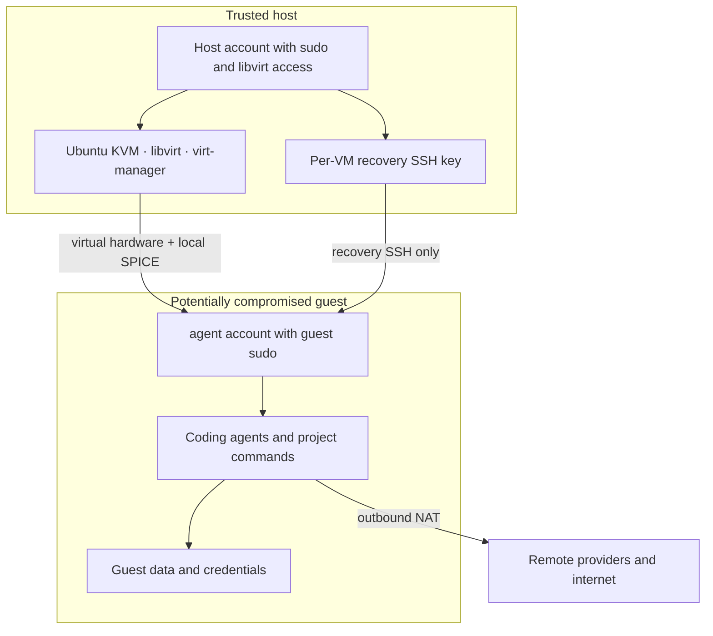

# Security policy and threat model

[日本語版](SECURITY_jp.md)

> This is an experimental reference design, not an audited isolation product.
> Report security defects privately when disclosure would put users at risk.
> General corrections and hardening proposals are welcome as issues or pull
> requests. [Full disclaimer](DISCLAIMER.md).

## Security objective

The objective is narrow: an autonomous coding agent should be able to damage or
replace its disposable VM without receiving equivalent control over the Ubuntu
host.

`virt-manager` and the command-line script are two clients for the same system
libvirt/KVM stack. Adding a graphical console does not move the agent onto the
host. It does add human-interface channels—display, keyboard, pointer, and
clipboard—that must be treated carefully.

The design is suitable for mistakes, destructive project commands, ordinary
malware containment, and convenient rollback. It does not claim to contain a
targeted attacker with a working hypervisor escape, protect data already placed
in the guest, or verify the third-party agent supply chain.

## Trust boundaries

| Component | Trust assumption |
|---|---|
| Physical machine, firmware, host kernel | Trusted foundation. Keep firmware and Ubuntu security updates current. |
| Host account | Trusted administrator. It has sudo and libvirt/KVM authority and can control or inspect every guest. |
| KVM, QEMU, libvirt, virt-manager | Security boundary implementation. A vulnerability here can invalidate guest isolation. |
| `agent` account | Untrusted for host purposes. It has passwordless sudo inside its disposable guest. |
| Coding agents, plugins, extensions, project build scripts | Potentially compromised. They may read or alter all guest-accessible state. |
| Remote model or API provider | Receives whatever the configured client sends. Its policy and technical controls are outside this VM boundary. |
| Recovery SSH key | Host-held, per-VM administrative path. It is not copied into the guest as a private key. |

The recovery path's first SSH connection uses
`StrictHostKeyChecking=accept-new` after selecting an address from the libvirt
lease table. That is trust on first use, not an out-of-band host-key proof. A
hostile co-resident guest able to race or impersonate that leased address could
cause confusion or denial of service during first contact. Dedicated
public-key authentication does not disclose the host private key, and later
connections pin the recorded host key. The optional swarm pairing path is
stronger: it verifies an independently displayed ED25519 fingerprint.

Membership in the host `libvirt` group is highly privileged: it commonly permits
defining a VM that reads host devices or files. Treat it as equivalent to host
root. Do not add untrusted or routine guest-only accounts to `libvirt`, `kvm`,
or host sudoers.

The simplified design deliberately uses one trusted host account, because that
account is both the human desktop user and the VM administrator. The
consequence is stated plainly: while the guest cannot reach the host account,
anything else that compromises that account — a hostile browser extension, a
careless `curl | sh` on the host, a phished sudo password — obtains host root
and therefore control of every VM. The VM boundary does not help in that
direction.

Two things follow from this, and they are the reason a separate VM-administrator
account exists in larger deployments:

- The account that views the guest console is the account that holds this
  privilege. Console-side channels — clipboard confusion, a look-alike prompt
  drawn by the guest, a defect in the SPICE client — therefore land in a
  privileged account rather than an unprivileged one.
- Ambient authority is always present. Nothing has to be unlocked before a
  `virsh` command that maps a host disk into a guest will run.

The script only adds the host account to `libvirt`, never to `kvm`; `kvm` exists
for the QEMU service account.

There is no easy way to keep one account and drop the ambient part of this
privilege on Ubuntu. Ubuntu configures libvirt for group-based socket access
rather than the polkit authentication that Debian and several other
distributions use, so simply leaving the `libvirt` group does not downgrade you
to a per-session password prompt — it removes access to `qemu:///system`
altogether. Converting to per-session authorisation means reconfiguring the
socket and authentication mechanism deliberately and verifying the result on
each Ubuntu release you support; treat it as a project, not a one-line
hardening step.

Until then, the practical mitigations are the ordinary ones: keep the host
account's other exposure low, apply host updates promptly, and prefer a
dedicated VM host over a machine that also serves as your browsing and mail
workstation.

## Protections

These controls are worth separating by who is able to remove them, because the
distinction decides how much weight each one carries.

### Enforced outside the guest

The guest cannot change these. They are properties of the host, the domain
definition, or the network, and they hold even when the `agent` account is fully
controlled by an attacker.

- agents and their upstream installers execute inside the guest;
- the Ubuntu base image is checked against Ubuntu's GPG-signed checksum list;
- libvirt uses hardware-assisted KVM isolation and a separate virtual disk;
- the SPICE console has no TCP listener at all: `virt-manager` reaches it
  through libvirt, so reaching the console requires libvirt management
  authorisation rather than merely a local login (other host administrators can
  still attach);
- networking uses libvirt NAT with no inbound port-forward rule;
- no host directory, socket, SSH agent, password-manager socket, or Docker
  socket is mounted into the guest;
- no USB or PCI device is passed through;
- the host generates a separate recovery key for each VM name; and
- the cloud-init seed, which carries the guest password hash, is created
  root-only — libvirt and QEMU still access it while the domain runs — and is
  removed once provisioning finishes; future cloud-init runs are disabled and
  cached guest-side cloud-init user-data is cleaned first.

### Defaults inside the guest

The `agent` account has passwordless sudo, so it can undo every item in this
list with a single command. They reduce accidental exposure and raise the cost
of an opportunistic compromise; they are not a boundary, and nothing should be
designed on the assumption that they still hold.

- the guest firewall denies outbound traffic to private and link-local address
  ranges — normally covering the host, other guests, and the physical LAN —
  while leaving internet access open (see [Network model](#network-model)); an
  explicitly selected swarm profile adds only overlay-interface exceptions;
- inbound SSH is normally accepted only from the libvirt gateway; an opt-in
  swarm worker additionally accepts it on the selected overlay interface;
- root and SSH password login are disabled;
- SSH agent forwarding and X11 forwarding are disabled;
- Ollama listens only on guest loopback; and
- no cloud credential or model weight is installed automatically.

Neither list is enforcement against a host administrator. `virt-manager` can
later add shares, devices, networks, or snapshots that change the threat model.

## GUI-specific risks

SPICE makes the VM pleasant to use but introduces interaction with untrusted
guest output.

- **Clipboard:** `spice-vdagent` enables clipboard integration. Do not copy
  passwords, private keys, recovery codes, or confidential text between the
  host and an untrusted guest. A guest may replace clipboard content; verify
  addresses and commands before pasting.
- **Display and terminal text:** malicious repositories can emit misleading
  control sequences, fake login prompts, or look-alike URLs. Treat the VM screen
  as untrusted content.
- **File drag-and-drop and shared folders:** not configured. Adding them creates
  a direct data channel; use narrow, temporary transfers instead.
- **USB redirection:** not configured. Passing through a security key or storage
  device exposes it to the guest.
- **Full screen:** convenient but easy to confuse with the host desktop. Keep a
  visible distinction and check which machine a password prompt belongs to.

If clipboard risk is unacceptable, disable `spice-vdagent` in the guest and
remove the SPICE agent channel in the VM hardware details.

## Network model

The libvirt network provides unrestricted outbound internet access through NAT.
This is required to install tools and is compatible with remote model services,
and it does not provide confidentiality against exfiltration.

By default the guest firewall additionally denies traffic to private address
space: `10/8`, `172.16/12`, `192.168/16`, and link-local ranges. DNS and DHCP to
the libvirt gateway remain open, and so does everything routed to the internet.
This normally closes the guest's reach into the host, other guests on the same
libvirt network, and a physical LAN behind it — routers, storage, printers, and
internal services that are commonly unauthenticated. It does not block locally
routed public address space. Use `--allow-lan` when an internal mirror or model
endpoint genuinely requires private-range egress. That option omits only these
outbound deny rules: UFW remains enabled, unsolicited inbound traffic remains
denied, and recovery SSH remains limited to the libvirt gateway.

The general deny list intentionally does not cover `100.64.0.0/10`, because an
opt-in Tailscale swarm uses that CGNAT range on `tailscale0`. Some ISP,
corporate, or carrier networks also route this range. If that matters in your
environment, enforce interface-specific policy outside the guest rather than
assuming every CGNAT destination is a Tailscale peer.

The optional manager/worker profile does not enable general LAN access. It adds
an outbound exception on `tailscale0` for Tailscale node addresses, or on `wg0`
for explicitly configured WireGuard peers. A worker also receives an inbound
TCP 22 exception on that overlay interface. Directional Tailscale grants or
narrow WireGuard peer routes remain necessary because the guest-local UFW rule
is not a host-enforced boundary. See
[Optional cross-host manager/worker VMs](docs/swarm.md) for the added lateral-
movement risk and endpoint trust model.

Because that rule set lives inside the guest, it is a default rather than a
boundary. Where enforcement is required, express the same policy as a libvirt
`nwfilter` on the guest interface, which the guest cannot edit.

There is no inbound mapping from the physical LAN. The host can reach the guest
on the private libvirt subnet, including its SSH service, which by default
accepts connections only from the libvirt gateway address.

For confidential local-model work, enforce an allow-list or isolated network
outside this script. A useful higher-assurance pattern is:

1. build and update a clean VM while internet access is allowed;
2. configure a separate local model endpoint;
3. remove general internet access at the libvirt or host firewall layer;
4. allow only the model endpoint and explicitly required package mirrors; and
5. test that DNS, IPv4, and IPv6 cannot provide an unintended fallback path.

Application settings alone are not a network security boundary.

## Automatic research-journal data flow

The optional journal defaults to deterministic evidence-only reporting. In
that mode the scheduled service receives a private network namespace and an
outbound IP deny rule; it does not call a model provider.

Claude or Codex enrichment requires the host operator to supply both a named
backend and `--journal-allow-remote-reporting`. This sends bounded repository
metadata—including commit subjects, changed-file paths, the project aim, phase
state, and structured journal prose—to that backend's remote provider. Do not
enable it when the project's embargo, NDA, ethics requirements, or provider
policy prohibit that transfer.

All repository text is attacker-controlled in this threat model. Before an
explicit remote call, the journal strips control and bidirectional-formatting
characters, caps text/list sizes, copies the evidence into an empty temporary
directory, and starts the model there rather than in the repository. Claude is
given no tool except `StructuredOutput`, the channel through which it returns
its own report; MCP servers, slash commands, and project customizations are
disabled. Codex is requested to ignore user config/rules
and use an ephemeral read-only, no-approval run. Output size and structure are
validated. These measures bound consequences but do not make model output
trusted; verify narrative claims against the canonical evidence JSON.

The scheduled-project registry is root-owned. This prevents accidental
same-user additions, not a compromised guest administrator: the normal guest
account has passwordless sudo and can alter any guest-local guardrail.

## Installer and update supply chain

The host installs only packages from Ubuntu's configured APT repositories. The
guest then follows the current official installation channels for Codex, Claude
Code, OpenCode, Aider dependencies, and Ollama. With `--formal-methods`, the
same rule applies to elan/Lean, GHCup/Haskell, HLint, VS Code, and its two
extensions. Isabelle2025-2 is the exception: its selected archive is checked
against a fixed reviewed SHA-256 value before extraction.

This is intentionally simpler than the former signed offline bundle and exact
lock files. The trade-off is important:

- a VM created today may receive different tool versions from a VM created
  later;
- TLS and the official download origin authenticate transport, not the
  maintainer's review of every downloaded byte;
- npm/Python/native lifecycle code can execute within the guest; and
- a malicious or compromised installer could read or modify all guest state and
  use its network connection.

Provision the empty guest before adding credentials or source code. The script
records installed versions in `/var/lib/kvm-agent/installed-versions.txt`.
Organizations requiring deterministic artifacts should maintain reviewed
hashes, an internal package mirror, or a signed golden image and should not rely
on the moving installer path.

## Credentials

Assume every process in one guest can eventually obtain every secret available
to that guest. Agent permission prompts are useful workflow controls, not the
primary isolation boundary.

Use a separate VM or clone for each trust domain. Prefer:

- short-lived or revocable provider tokens;
- project-scoped Git credentials without organization administration;
- spending limits and provider-side alerts;
- MFA or passkeys completed on a separate trusted device where supported;
- no SSH-agent forwarding;
- no host browser profile, password-manager database, signing key, or cloud
  administrator credential in the guest; and
- explicit sign-out and token revocation before sharing a VM image.

See [Credential handling](docs/credentials.md).

## Data, snapshots, and deletion

Snapshots and clones contain the VM's entire state, potentially including
source code, browser sessions, API keys, shell history, swap, and deleted file
fragments. Protect and expire them like the live VM.

Deleting a qcow2 file is not a guaranteed secure erase on SSDs, copy-on-write
filesystems, backups, or snapshots. Use full-disk encryption on the host for
data at rest, keep confidential guests on appropriately managed storage, and
destroy or rotate external credentials independently of local deletion.

Review changes before exporting them to an important repository. Prefer a patch
or a dedicated branch over giving the guest broad push access to a canonical
upstream.

## Out of scope

This repository does not provide:

- formally verified isolation or protection against all VM escapes;
- measured boot, remote attestation, Secure Boot policy, or encrypted guest
  storage;
- GPU or USB passthrough hardening;
- a mandatory egress firewall or data-loss-prevention system;
- protection from a malicious host administrator;
- provider confidentiality guarantees;
- review or pinning of every downloaded agent release;
- secure erase; or
- backup, disaster recovery, endpoint detection, or organizational compliance.

## Operational checklist

Before first use:

- update the host firmware and Ubuntu;
- confirm `/dev/kvm` exists and the host uses full-disk encryption when needed;
- provision without project data or reusable credentials;
- inspect `cloud-init status --long` and the provisioning log;
- confirm Ollama listens only on `127.0.0.1:11434`; and
- take a clean, credential-free snapshot.

Before each sensitive project:

- restore or clone a known-clean image;
- review VM devices, networks, shares, and snapshots in `virt-manager`;
- add only scoped credentials and approved files;
- verify the selected model endpoint and its data policy; and
- keep host secrets out of the clipboard.

After the project:

- review and export the intended changes;
- sign out and revoke or rotate guest credentials;
- remove confidential snapshots and clones; and
- rebuild when guest integrity is uncertain.
