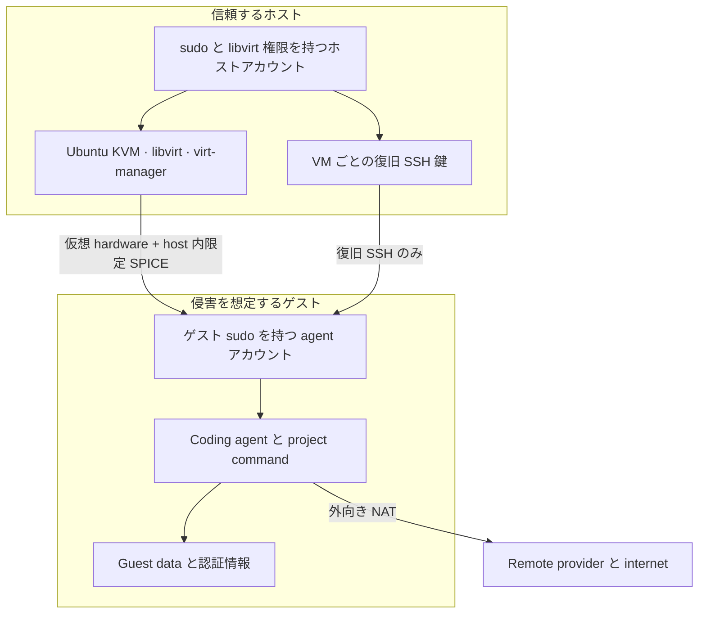

# セキュリティポリシーと脅威モデル

[English](SECURITY.md)

> これは実験的な参照設計であり、監査済み隔離製品ではありません。公開すると
> 利用者を危険にさらすセキュリティ欠陥は非公開で報告してください。一般的な
> 訂正や hardening 提案は issue または pull request で歓迎します。
> [免責事項全文](DISCLAIMER_jp.md)。

## セキュリティ目標

目標は限定的です。自律的コーディングエージェントが交換可能な VM を破壊・置換
できても、Ubuntu ホストに対する同等の制御権は得られないようにします。

`virt-manager` とコマンドラインスクリプトは、同じ system libvirt/KVM stack を
操作する二つの client です。GUI console を追加しても agent は host 上へ移りません。
ただし display、keyboard、pointer、clipboard という人間との interface channel が
追加されるため、注意して扱う必要があります。

この設計は、操作ミス、破壊的な project command、通常の malware 封じ込め、容易な
rollback に向いています。実用的な hypervisor escape を持つ標的型攻撃者を必ず
封じ込めること、既に guest へ入れた data を守ること、第三者 agent supply chain を
検証することは主張しません。

## 信頼境界

| 構成要素 | 信頼上の前提 |
|---|---|
| 物理 machine、firmware、host kernel | 信頼基盤。firmware と Ubuntu security update を最新に保つ。 |
| Host account | 信頼する管理者。sudo と libvirt/KVM 権限を持ち、全 guest を制御・検査できる。 |
| KVM、QEMU、libvirt、virt-manager | セキュリティ境界の実装。ここに脆弱性があれば guest 隔離が崩れる。 |
| `agent` account | Host にとって非信頼。交換可能な guest 内では password なし sudo を持つ。 |
| Coding agent、plugin、extension、project build script | 侵害を想定。guest から見える全状態を読み書きできる可能性がある。 |
| Remote model/API provider | 設定した client が送信した内容を受け取る。その policy・技術的制御は VM 境界の外。 |
| 復旧 SSH 鍵 | Host が保持する VM 固有の管理経路。秘密鍵を guest 内へコピーしない。 |

Recovery path の最初の SSH 接続は libvirt lease table から address を選んだ後、
`StrictHostKeyChecking=accept-new` を使います。これは out-of-band host-key proof ではなく
trust on first use です。同居する hostile guest が lease address を race・impersonate できれば、
first contact で confusion/DoS を起こし得ます。Dedicated public-key authentication から host
private key は漏れず、以後は記録した host key を pin します。任意 swarm pairing path は
別表示された ED25519 fingerprint を検証するため、より強い first-contact verification です。

Host の `libvirt` group 所属は強い権限です。通常、host device や file を読む VM を
定義できるためです。host root と同等とみなしてください。非信頼利用者や guest 専用の
日常 account を host の `libvirt`、`kvm`、sudoers へ追加しないでください。

簡略化した設計では、人が使う desktop user と VM 管理者が同一なので、一つの信頼済み
host account を意図的に使います。その帰結を明示します。guest からその host account
へ到達することはできませんが、それ以外の経路 — 悪意ある browser 拡張、host での
不用意な `curl | sh`、phishing による sudo password 漏洩 — でその account が侵害され
れば、host root と全 VM の制御を得られます。この方向に VM 境界は効きません。

ここから 2 点が導かれ、これが大規模な環境で VM 管理者 account を分ける理由です。

- guest console を表示する account が、この権限を持つ account でもあります。
  clipboard の混同、guest が描く偽の prompt、SPICE client の欠陥といった console 側
  の経路が、非特権 account ではなく特権 account に着地します。
- 権限が常時有効です。host disk を guest に map する `virsh` command を実行する前に、
  解除すべきものが何もありません。

Script は host account を `libvirt` にのみ追加し、`kvm` には追加しません。`kvm` は
QEMU service account のための group です。

ただし Ubuntu では、account を一つに保ったまま常時有効な部分だけを外す簡単な方法は
ありません。Ubuntu は libvirt を、Debian などが使う polkit 認証ではなく group による
socket access で構成しています。そのため `libvirt` group から抜けても session ごとの
password 入力に下がるのではなく、`qemu:///system` へ接続できなくなります。session
ごとの認可へ変更するには socket と認証機構を意図的に再構成し、対応する各 Ubuntu
release で検証する必要があります。1 行の hardening ではなく、一つの作業として
扱ってください。

それまでの現実的な緩和策は通常のものです。host account の他の露出を小さく保ち、
host の update を速やかに適用し、browsing や mail にも使う workstation ではなく
専用の VM host を用意してください。

## 防護

これらの制御は「誰が解除できるか」で分けて理解する必要があります。その区別が、
各項目にどれだけの重みを置けるかを決めます。

### Guest の外で強制されるもの

Guest から変更できません。host、domain 定義、network の性質であり、`agent`
account が完全に攻撃者の制御下にあっても成立します。

- agent と上流 installer は guest 内で実行する。
- Ubuntu base image は Ubuntu の GPG 署名済み checksum 一覧で検証する。
- libvirt は hardware 支援 KVM 隔離と独立 virtual disk を使う。
- SPICE console は TCP listener を一切持たない。`virt-manager` は libvirt 経由で
  接続するため、console への到達には単なる local login ではなく libvirt の管理権限が
  必要になる（他の host 管理者は接続できる）。
- network は libvirt NAT を使い、外部からの port forward rule は作らない。
- host directory、socket、SSH agent、password-manager socket、Docker socket を
  guest へ mount しない。
- USB または PCI device を passthrough しない。
- VM 名ごとに別の復旧鍵を host で作る。
- ゲストパスワードの hash を含む cloud-init seed は root 限定で作成し（domain 実行中は
  libvirt と QEMU が access する）、将来の cloud-init 実行を guest 内で無効化してから
  guest 内に cache された cloud-init user-data も clean し、プロビジョニング完了後に
  seed を削除する。

### Guest 内の既定値

`agent` account は password なし sudo を持つため、以下は 1 コマンドで解除できます。
偶発的な露出を減らし、日和見的な侵害の費用を上げますが、境界ではありません。これ
らが維持されている前提で設計しないでください。

- guest firewall が private・link-local address range（通常は host、他 guest、
  物理 LAN を含む）への外向き通信を遮断する。internet 接続は開いたまま
  （[ネットワークモデル](#ネットワークモデル)）。明示的に選択した swarm profile は
  overlay interface だけに exception を追加する。
- inbound SSH は通常 libvirt gateway からのみ受け付ける。Opt-in の swarm worker は
  選択した overlay interface 上でも受け付ける。
- root login と SSH password login を無効にする。
- SSH agent forwarding、X11 forwarding、tunnel、user startup hook、port
  forwarding を無効にする。Client 発 local forwarding は両端で明示する
  remote-editor opt-in の場合だけ許可する。
- Ollama は guest loopback だけで待ち受ける。
- cloud credential や model weight を自動導入しない。

いずれも host 管理者への強制ではありません。後から `virt-manager` で share、
device、network、snapshot を追加すれば脅威モデルも変化します。
`ForwardAgent no`、`ForwardX11 no`、`ClearAllForwardings yes` を明記する理由を含む
client/server option は[安全なリモートアクセス](docs/remote-access_jp.md)で説明します。

## GUI 固有のリスク

SPICE は VM を使いやすくしますが、非信頼 guest 出力との接点を増やします。

- **Clipboard:** `spice-vdagent` により clipboard 連携が可能です。password、
  private key、recovery code、機密 text を host と非信頼 guest の間で copy
  しないでください。guest が clipboard 内容を置き換える可能性があるため、
  address や command は paste 前に確認します。
- **Display と terminal text:** 悪意ある repository は、誤解させる control
  sequence、偽 login prompt、見た目の似た URL を表示できます。VM 画面を
  非信頼 content として扱います。
- **File drag-and-drop と shared folder:** 既定では設定しません。追加すると
  直接的 data channel になるため、限定的・一時的な転送を使います。
- **USB redirection:** 既定では設定しません。security key や storage device を
  passthrough すると guest に公開されます。
- **Full screen:** 便利ですが host desktop と取り違えやすくなります。見分けを
  残し、password prompt がどちらの machine のものか確認します。

Clipboard risk を許容できない場合は、guest の `spice-vdagent` を無効にし、
VM hardware 詳細から SPICE agent channel を外してください。

## ネットワークモデル

libvirt network は NAT 経由の無制限な外向き internet 接続を提供します。tool 導入や
remote model service には必要であり、情報流出に対する機密性は提供しません。

既定ではこれに加えて、guest firewall が private address space（`10/8`、
`172.16/12`、`192.168/16`、link-local）への通信を拒否します。libvirt gateway への
DNS と DHCP、および internet 向けの通信は開いたままです。通常はこれにより、host、
同じ libvirt network 上の他 guest、その先の物理 LAN — 認証のないことが多い router、
storage、printer、社内 service — への到達が閉じます。local に route された public
address space は遮断しません。社内 mirror や model endpoint のために private range
への通信が本当に必要な場合だけ `--allow-lan` を使ってください。この option が省く
のは outbound deny rule だけです。UFW は有効なままで、未要求の inbound 通信は拒否
され、復旧 SSH は引き続き libvirt gateway だけに限定されます。

一般 deny list は `100.64.0.0/10` を意図的に含みません。Opt-in Tailscale swarm が
`tailscale0` 上でこの CGNAT range を使うためです。一部 ISP・企業・carrier network も
この range を route します。該当する環境では全 CGNAT destination を Tailscale peer と
見なさず、guest 外で interface-specific policy を強制してください。

任意の manager/worker profile は一般 LAN access を有効にしません。Tailscale では
`tailscale0` 上の Tailscale node address への outbound exception、WireGuard では明示的に
構成した peer 用の `wg0` outbound exception だけを追加します。Worker には同じ overlay
interface 上の inbound TCP 22 exception も追加します。Guest-local UFW は host-enforced
boundary ではないため、directional Tailscale grant または narrow WireGuard peer route が
引き続き必要です。追加される lateral-movement risk と endpoint trust model は
[任意の cross-host manager/worker VM](docs/swarm_jp.md)を参照してください。

この rule 群は guest 内部にあるため、境界ではなく既定値です。強制が必要な場合は、
同じ policy を guest が編集できない libvirt `nwfilter` として guest interface に
記述してください。

物理 LAN からの inbound mapping はありません。host は private libvirt subnet 上で
guest の SSH を含む service に到達できます。その SSH は既定で libvirt gateway
address からの接続のみを受け付けます。

機密性の高い local-model 作業では、この script の外で allow-list または隔離
network を強制してください。より高い保証を目指す一例:

1. internet 接続を許可して clean VM を build・update する。
2. 別の local model endpoint を設定する。
3. libvirt または host firewall 層で一般 internet 接続を除去する。
4. model endpoint と明示的に必要な package mirror だけを許可する。
5. DNS、IPv4、IPv6 に意図しない fallback path がないことを試験する。

Application 設定だけを network security boundary と見なしてはいけません。

## 自動 research journal の data flow

任意 journal の default は deterministic evidence-only report です。この mode の scheduled
service は private network namespace と outbound IP deny を使い、model provider を呼びません。

Claude/Codex enrichment には named backend と
`--journal-allow-remote-reporting` の両方を host operator が指定する必要があります。
Commit subject、changed-file path、project aim、phase state、structured journal prose の
長さ制限済み metadata が backend の remote provider へ送信されます。Embargo、NDA、ethics
requirement、provider policy が送信を禁止する project では有効化しないでください。

この threat model では repository text は全て attacker-controlled です。明示的な remote call
の前に control/bidirectional-formatting character を除去し、text/list size を制限し、evidence を
空の temporary directory へ copy し、repository ではなくそこで model を起動します。Claude
には自身の report を返す channel である `StructuredOutput` 以外の tool を与えず、MCP server、
slash command、project customization を無効化します。Codex には user config/rule の無視、ephemeral、read-only、
no-approval run を要求します。Output structure と size も検証します。これは影響を限定しますが
model output を trusted にはしません。Narrative claim を canonical evidence JSON と照合してください。

Scheduled-project registry は root 所有です。これは same-user による偶発的追加を防ぎますが、
guest administrator 侵害への境界ではありません。通常 guest account は passwordless sudo で
guest-local guardrail を変更できます。

## Installer と update の supply chain

Host が導入するのは、設定済み Ubuntu APT repository の package だけです。その後、
guest が Codex、Claude Code、OpenCode、Aider 依存関係、Ollama の現在の公式
installation channel を利用します。`--formal-methods` では elan/Lean、
GHCup/Haskell、HLint、VS Code、二つの extension にも同じ方針を適用します。
Isabelle2025-2 は例外で、選択 archive を展開前に固定の review 済み SHA-256 と
照合します。

これは以前の署名済み offline bundle と厳密 lock file より意図的に単純です。
次の trade-off が重要です。

- 今日作った VM と後日作った VM で tool version が異なる可能性がある。
- TLS と公式 download origin は通信経路を認証するが、全 download byte を
  maintainer がレビューしたことは保証しない。
- npm/Python/native lifecycle code が guest 内で実行され得る。
- 悪意ある、または侵害された installer は guest の全状態を読み書きし、network
  接続を使える。

認証情報や source code を入れる前に、空 guest の provisioning を完了します。
導入 version は `/var/lib/kvm-agent/installed-versions.txt` に記録します。
deterministic artifact が必要な組織は、review 済み hash、内部 package mirror、
署名済み golden image を管理し、更新される installer 経路に依存しないでください。

## 認証情報

一つの guest 内の各 process は、最終的にはその guest から利用可能な全 secret を
取得できるものと考えてください。Agent の permission prompt は有用な workflow
control ですが、主要な isolation boundary ではありません。

信頼領域ごとに別 VM または clone を使います。次を推奨します。

- 短期または失効可能な provider token。
- Organization 管理権限を持たない project 限定 Git credential。
- 利用上限と provider 側 alert。
- 対応する場合、別の信頼端末で完了する MFA または passkey。
- SSH agent forwarding を使わない。
- Host browser profile、password-manager database、signing key、cloud
  administrator credential を guest へ入れない。
- VM image を共有する前に明示的に sign out し token を失効する。

[認証情報の取り扱い](docs/credentials_jp.md)も参照してください。

## Data、snapshot、削除

Snapshot と clone は VM 全状態を含み、source code、browser session、API key、
shell history、swap、削除 file 断片を含む可能性があります。live VM と同様に保護し、
期限を設けます。

qcow2 file の削除は、SSD、copy-on-write filesystem、backup、snapshot 上の安全な
消去を保証しません。保存 data に host full-disk encryption を使い、機密 guest を
適切に管理した storage に置き、local deletion と独立に外部 credential を破棄・
rotate してください。

重要 repository へ出す前に変更を review します。guest へ canonical upstream の
広い push 権限を与えるより、patch または専用 branch を使ってください。

## 対象外

この repository は次を提供しません。

- 形式検証済み隔離、または全 VM escape への保護。
- measured boot、remote attestation、Secure Boot policy、暗号化 guest storage。
- GPU/USB passthrough の hardening。
- 強制 egress firewall または DLP。
- 悪意ある host 管理者からの保護。
- Provider の機密性保証。
- 全 agent release の review と pin。
- 安全な消去。
- Backup、disaster recovery、endpoint detection、組織 compliance。

## 運用チェックリスト

初回利用前:

- host firmware と Ubuntu を update する。
- `/dev/kvm` の存在と、必要なら host full-disk encryption を確認する。
- project data や再利用 credential なしで provision する。
- `cloud-init status --long` と provisioning log を確認する。
- Ollama が `127.0.0.1:11434` だけで listen することを確認する。
- credential のない clean snapshot を作る。

機密 project ごと:

- known-clean image を復元または clone する。
- `virt-manager` で VM device、network、share、snapshot を review する。
- scope を限定した credential と承認済み file だけを追加する。
- 選択した model endpoint と data policy を確認する。
- host secret を clipboard へ入れない。

Project 終了後:

- 意図した変更を review・export する。
- guest credential から sign out し、失効または rotate する。
- 機密 snapshot と clone を削除する。
- guest integrity が不明なら rebuild する。
