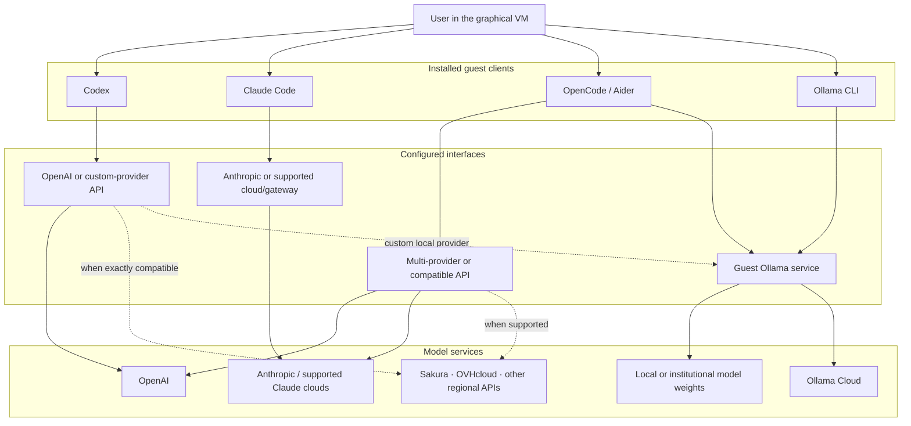

# Agent tools and model services

[日本語版](agent-tools-and-model-services_jp.md)

The five installed commands do not all play the same role. Codex, Claude Code,
OpenCode, and Aider are coding-agent clients. Ollama is primarily a model
runtime and model-service client.

The following is a map of possible layers, not a promise that every edge works
with every model. Provider support, authentication, wire protocols, tool
calling, and model quality change independently.

## Layers

| Layer | Examples | Function |
|---|---|---|
| Human interface | GNOME terminal, `virt-manager` console | Lets the user work in the guest; it is not the model provider. |
| Coding-agent client | Codex, Claude Code, OpenCode, Aider | Reads the workspace, plans edits, calls tools, and sends selected context to a model service. |
| Model runtime/client | Ollama service and CLI | Loads available model weights or connects to supported Ollama services. It is not itself a general coding-agent replacement. |
| Model provider | OpenAI, Anthropic, Ollama Cloud, Sakura AI Engine, OVHcloud, institutional server | Performs inference and receives the prompts/context sent by the chosen client. |

## Practical distinctions

| Client | Direct path | Broader path | Qualification |
|---|---|---|---|
| Codex | OpenAI through Codex's documented authentication | Custom provider definitions, including compatible local endpoints | A base URL alone is insufficient; the endpoint and model must implement behavior Codex expects. |
| Claude Code | Anthropic or Anthropic-supported cloud deployments/gateways | Organization-controlled routing supported by Anthropic | A superficially compatible endpoint does not make non-Claude models an officially supported Claude Code backend. |
| OpenCode | Many native providers and local models | Custom/compatible endpoints in its provider system | Confirm current provider docs and actual agent operations before depending on a combination. |
| Aider | OpenAI, Anthropic, and model-layer providers | OpenAI-compatible endpoints and Ollama models | API compatibility does not guarantee reliable editing, context handling, or tool use. |
| Ollama | Guest loopback service with local weights | Ollama Cloud after explicit sign-in | It is a model interface. Installing it downloads no model and performs no login. |

Sakura AI Engine, OVHcloud, and similar regional services are examples, not
integrations configured or guaranteed by this repository. Use them when the
chosen client officially supports the service or the provider exposes the exact
protocol required by that client. Test a real multi-step agent task, not only a
one-line chat response.

## Local client versus local inference

All five commands run locally in the guest, but inference is local only when the
model service and weights are also operated within the intended local boundary.

- Codex or Claude Code connected to a remote provider sends selected material
  outside the VM.
- A regional API is still remote inference.
- `ollama signin` followed by an Ollama Cloud model is remote inference.
- A separate institutional Ollama server is local to the organization only if
  its network path, logs, telemetry, backups, and fallback endpoints remain
  inside the approved boundary.

The guest loopback bind prevents unsolicited access to Ollama from outside the
guest. It does not isolate Ollama from a compromised coding agent inside that
same VM.

## How each tool is installed in the guest

Codex, Claude Code, and OpenCode are installed by running their official
installers as the unprivileged `agent` account. Aider is installed by that same
account through an isolated `uv` tool environment.

Ollama is invoked directly as root, because it registers a systemd service. The
distinction is narrower than it looks, however: `agent` holds unrestricted
passwordless sudo, so every installer can become root simply by asking. Treat
all of them as having effective guest-root capability; Ollama's is merely the
one that starts there.

This is one more reason the VM — not the guest account — is the security
boundary. The installers are staged in a root-owned directory and are not
writable by the guest account before they run, which prevents tampering between
download and execution, but their contents are whatever the vendor is publishing
at that moment.

## Choosing a route

- For the most direct supported experience, pair each first-party agent with its
  documented provider.
- For provider portability, evaluate OpenCode, Aider, and Codex custom providers
  against the exact API and required agent features.
- For confidential work, use a controlled local endpoint and enforce network
  policy outside the application.
- Put only one project's required providers and credentials in each VM.
- Expect first-party combinations to receive new agent features sooner, while
  broader clients may reduce provider lock-in.

Installing every client preserves options; it does not make them interchangeable
or make every configured model capable of autonomous coding.

