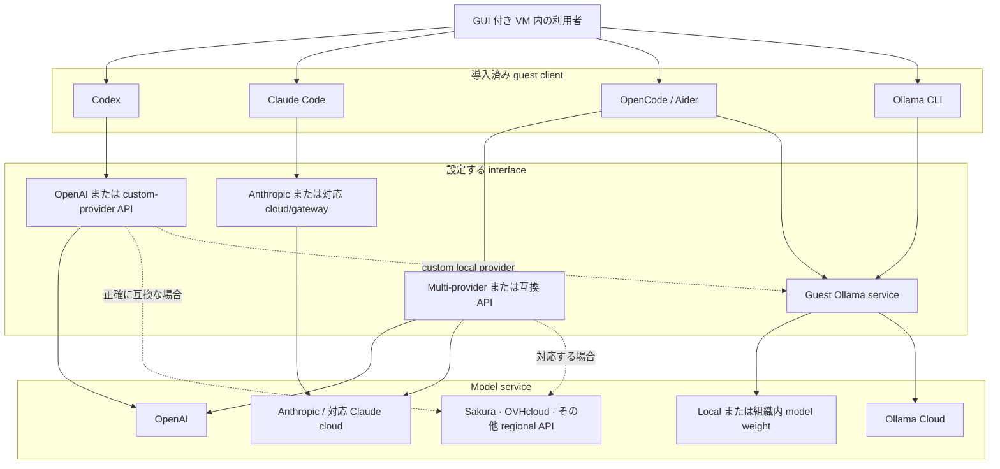

# エージェントツールとモデルサービス

[English](agent-tools-and-model-services.md)

導入する五つの command は同じ役割ではありません。Codex、Claude Code、
OpenCode、Aider は coding-agent client です。Ollama は主に model runtime と
model-service client です。

次の図は可能な layer の地図であり、全 edge が全 model で動くという保証では
ありません。Provider support、認証、wire protocol、tool calling、model quality は
互いに独立して変化します。

## Layer

| Layer | 例 | 機能 |
|---|---|---|
| Human interface | GNOME terminal、`virt-manager` console | 利用者が guest で作業するためのもの。model provider ではない。 |
| Coding-agent client | Codex、Claude Code、OpenCode、Aider | Workspace を読み、編集を計画し、tool を呼び、選んだ context を model service へ送る。 |
| Model runtime/client | Ollama service と CLI | 利用可能な model weight を load するか、対応 Ollama service へ接続する。一般 coding-agent の代替そのものではない。 |
| Model provider | OpenAI、Anthropic、Ollama Cloud、Sakura AI Engine、OVHcloud、組織 server | 推論を行い、client が送った prompt/context を受け取る。 |

## 実用上の違い

| Client | 直接経路 | より広い経路 | 留意点 |
|---|---|---|---|
| Codex | Codex の文書化された認証を通じた OpenAI | 互換 local endpoint を含む custom provider 定義 | Base URL だけでは足りず、endpoint と model が Codex の期待する動作を実装する必要がある。 |
| Claude Code | Anthropic または Anthropic 対応 cloud deployment/gateway | Anthropic が対応する組織管理 routing | 表面的に互換な endpoint だけでは non-Claude model が公式対応 backend にならない。 |
| OpenCode | 多数の native provider と local model | Provider system の custom/compatible endpoint | 依存前に現在の provider 文書と実際の agent operation を確認する。 |
| Aider | OpenAI、Anthropic、model layer の provider | OpenAI-compatible endpoint と Ollama model | API 互換性だけでは編集、context、tool use の信頼性を保証しない。 |
| Ollama | Local weight を持つ guest loopback service | 明示的 sign-in 後の Ollama Cloud | Model interface である。導入だけでは model download も login もしない。 |

Sakura AI Engine、OVHcloud、同様の regional service は例であり、この repository が
設定・保証する integration ではありません。選択 client が service を公式対応するか、
provider がその client の要求する正確な protocol を提供する場合に使ってください。
一行 chat response ではなく、実際の multi-step agent task を試験します。

## Local client と local inference の違い

五つの command は全て guest 内で local に動きますが、inference が local なのは
model service と weight も意図した local boundary 内で運用する場合だけです。

- Remote provider に接続した Codex/Claude Code は選択した material を VM 外へ送る。
- Regional API も remote inference。
- `ollama signin` 後の Ollama Cloud model も remote inference。
- 別の組織内 Ollama server が組織 local なのは、network path、log、telemetry、
  backup、fallback endpoint も承認 boundary 内にある場合だけ。

Guest loopback bind は guest 外から Ollama への意図しない access を防ぎます。同じ VM
内の侵害された coding agent から Ollama を隔離するものではありません。

## Guest 内での各 tool の導入方法

Codex、Claude Code、OpenCode は、非特権の `agent` account として公式 installer を
実行して導入します。Aider も同じ account が隔離された `uv` tool 環境で導入します。

Ollama は systemd service を登録するため、直接 root として実行されます。ただしこの
区別は見た目ほど大きくありません。`agent` は制限のない password なし sudo を持つ
ため、どの installer も要求するだけで root になれます。すべての installer が実効的
に guest root の能力を持つものとして扱ってください。Ollama はそこから始まるという
だけです。

これは、セキュリティ境界が guest account ではなく VM である理由の一つでもあります。
Installer は root 所有の directory に配置され、実行前に guest account から書き換え
られることはないため download から実行までの改竄は防げますが、その中身はその時点で
vendor が公開しているものです。

## 経路の選択

- 最も直接的な対応体験には、各 first-party agent と文書化された provider を組み合せる。
- Provider portability には OpenCode、Aider、Codex custom provider を正確な API と
  必要 agent feature に対して評価する。
- Confidential work では管理 local endpoint を使い、application 外で network policy を
  強制する。
- 各 VM に一 project が必要とする provider/credential だけを置く。
- First-party 組合せは新 agent feature を早く得やすく、より広い client は provider
  lock-in を減らし得ると考える。

全 client の導入は選択肢を保つためであり、互換性を作るものでも、全 model を自律 coding
可能にするものでもありません。
