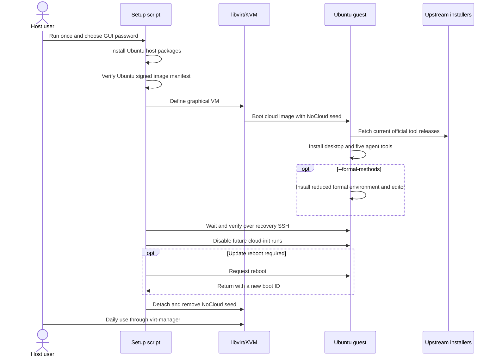

# Design and trust boundaries

[日本語版](design_jp.md)

## Why one script

The previous repository separated host installation, account creation, image
fetching, VM creation, cloud-init templates, online and offline tool bundles,
formal-methods profiles, and guest helpers. That design exposed many controls,
but the ordinary personal workflow required understanding the implementation
before creating one VM.

The current design keeps only one operator-facing action:

```bash
./setup-kvm-agent.sh
```

The file still has internal phases and fails closed at important boundaries, but
the user no longer moves between host accounts, configuration files, helper
scripts, or provisioning modes.

## Control and data flow



The coding-agent installers never run in the script's host process. Cloud-init
copies an embedded guest provisioning program into the VM and executes it there.
The host waits over a dedicated SSH key so a guest failure is visible rather
than being mistaken for success.

## Why a cloud image plus desktop

An Ubuntu Desktop ISO and the `virt-manager` installation wizard are excellent
for a manually built VM, but they cannot provide one unattended command that
also installs the requested agents. An official Ubuntu Server cloud image has
cloud-init and can be created without automating graphical installer screens.
The guest then installs `ubuntu-desktop-minimal`, GNOME's display manager,
`spice-vdagent`, and `qemu-guest-agent`.

The result is a normal graphical Ubuntu environment for daily use while keeping
the creation process scriptable. After successful provisioning, the host
disables future cloud-init runs in that guest. It then performs any required
first reboot, verifies that the kernel boot ID changed, detaches the NoCloud
seed, and removes the seed file.

The post-reboot wait re-queries libvirt DHCP leases because an address is not a
stable VM identity. It also requires a changed kernel boot ID because
`systemctl reboot` returns before shutdown completes and SSH can briefly remain
available on the old boot. If host-side waiting is interrupted,
`setup-kvm-agent.sh --finalize-existing` invokes the same internal marker
verification, cloud-init disabling, and fail-closed seed detachment without
recreating the working VM. Provisioning completion is checked by short,
non-blocking polls. Every recovery SSH invocation is also wrapped in a
host-side deadline, so neither an SSH session nor a remote cloud-init command
can bypass the overall retry limit.

## Disk sizing and future cloud adapters

The local default is 120 GiB. This is intentionally comfortable for a
graphical development guest, formal-method toolchains, build products, and
agent workspaces. The qcow2 image is thin-provisioned, so the default does not
reserve 120 GiB on the host immediately. Setup nevertheless checks a minimum
amount of host backing space, verifies the qcow2 virtual size, explicitly
grows the Ubuntu root partition and filesystem, and refuses large package
installation until `/` exposes at least 90% of the requested size.

The same numeric default should not be hard-coded into every future provider
adapter:

- AWS EBS gp3 accepts a 120 GiB volume, but charges for provisioned capacity
  rather than the blocks that the guest has written.
- Sakura Cloud exposes fixed disk-plan sizes; its documented choices include
  100 GB and 250 GB rather than 120 GB.

For that reason, a future AWS/Sakura implementation should share the
guest-provisioning payload and its capacity verification, while keeping
provider-specific VM, network, storage, and cleanup adapters. A 100 GB Sakura
disk should normally hold this reduced theorem-proving profile; 250 GB is the
next documented plan when projects, model weights, or datasets need more.
Provider adapters must pass the capacity actually provisioned to the guest
verification instead of pretending that every backend supplied 120 GiB.

## Why system libvirt

The script uses `qemu:///system`, the same connection normally shown by
`virt-manager`. System libvirt:

- keeps VMs running independently of one terminal process;
- gives `virt-manager`, `virt-viewer`, and `virsh` a consistent inventory;
- stores VM disks under `/var/lib/libvirt/images`;
- uses Ubuntu's libvirt service confinement and device permissions; and
- allows the host user to log out without terminating the guest.

The host user is added to `libvirt` only. This is administrative power, not a
sandbox: that account can control the guests and should remain trusted.

## Graphics choices

The VM uses:

| Device | Reason |
|---|---|
| SPICE display with no TCP listener (`listen=none`) | Rich local console, reached through libvirt, with no socket for other local accounts to attach to |
| Virtio video | Efficient Linux guest graphics |
| USB tablet input | Accurate pointer position without awkward mouse capture |
| `spice-vdagent` | Dynamic desktop integration and clipboard support |
| `qemu-guest-agent` | Reliable guest reporting and management |
| Serial console | Recovery evidence when the desktop does not start |

No 3D acceleration or GPU passthrough is configured. Local Ollama therefore
runs on CPU unless the user deliberately changes the VM hardware and guest
installation. Large local models are usually better placed on a separate
GPU-equipped server with an explicitly restricted network path.

## Image authentication

The script downloads:

- `SHA256SUMS`;
- `SHA256SUMS.gpg`; and
- the named Ubuntu cloud image.

`gpgv` checks the manifest with Ubuntu's cloud-image keyring installed from the
Ubuntu APT repository. `sha256sum` then checks the image against the authenticated
manifest. A cached image is reused only when its hash matches the locally
recorded value created after this verification.

This authenticates the Ubuntu image, not every package or third-party agent
release installed later.

## Accounts

| Account | Location | Purpose |
|---|---|---|
| Invoking Ubuntu user | Host | Trusted desktop user, sudo administrator, and libvirt operator |
| `libvirt-qemu` or equivalent | Host service | Runs QEMU under Ubuntu's libvirt configuration |
| `agent` | Guest | Human GUI login, coding-agent execution, and guest administration |
| `ollama` | Guest service | Runs the loopback-only Ollama server |

The guest `agent` account has passwordless sudo. Its GUI password prevents
casual local login; it is not intended to constrain a coding agent already
running as that user. The security boundary is the VM.

The invoking host account is added to `libvirt` and to nothing else. It is not
added to `kvm`: that group belongs to the QEMU service account, and putting a
human in it would make the VM disk and the cloud-init seed — which carries the
guest password hash — readable by that human's account for no benefit.

Why there is no separate VM-administrator account: the split never contained
the agent. Containment comes from KVM, and it is identical either way. What a
split changes is what an attacker reaches after compromising the *host* desktop
account, and what privilege the console viewer is holding while it renders
untrusted guest output. Running everything through the guest GUI reduces how
much else that host account does, which is a real argument for merging the two;
it does not make the merge free. `SECURITY.md` states the residual risk and the
one-command way to drop the ambient part of it without adding an account.

## Recovery SSH

The setup script creates:

```text
~/.local/share/kvm-agent/VM_NAME/id_ed25519
```

Only the public key enters the guest. Password authentication, root login, SSH
agent forwarding, and X11 forwarding are disabled. The key is for provisioning
status and recovery when the GUI is unavailable; daily work may remain entirely
inside `virt-manager`.

The host key is stored in a per-VM `known_hosts` file. Reusing a VM name does not
silently share one global host-key decision with other SSH connections.

## Tool installation policy

Codex, Claude Code, OpenCode, and Ollama are installed from their current
official native installer channels. Aider is installed as the guest user via
`uv` in an isolated tool environment. The script checks that every CLI reports a
version and that Ollama responds only on guest loopback.

The optional `--formal-methods` branch is part of the same embedded guest
program, not a restored provisioning subsystem. It adds only Lean/elan,
Isabelle2025-2/HOL, GHCup/GHC/Cabal/HLS/HLint, guest-side VS Code, and the
official Lean and Haskell extensions. Isabelle's archive has a fixed reviewed
checksum; the other tools follow their current official channels.

This is release-channel reproducibility, not byte-level reproducibility. The
former comprehensive profiles, package locks, and signed offline ISO path were
removed to make the ordinary setup small and maintainable. Users with
institutional artifact-review requirements should build an internally signed
golden image instead of treating this personal convenience path as a
supply-chain guarantee.

## Deliberately omitted features

- separate `vmadmin` and `devui` host accounts;
- offline agent bundles;
- host/guest shared inboxes;
- automatic GitHub fork or deploy-key setup;
- VS Code installation on the host;
- comprehensive or selectable formal-methods profiles beyond the single
  reduced opt-in set;
- host-enforced network policy: the private-network block is a guest firewall,
  not a libvirt `nwfilter`;
- GPU and USB passthrough; and
- automatic VM destruction.

These can be useful in a particular organization, but none is necessary to
create and operate a graphical disposable agent VM.
