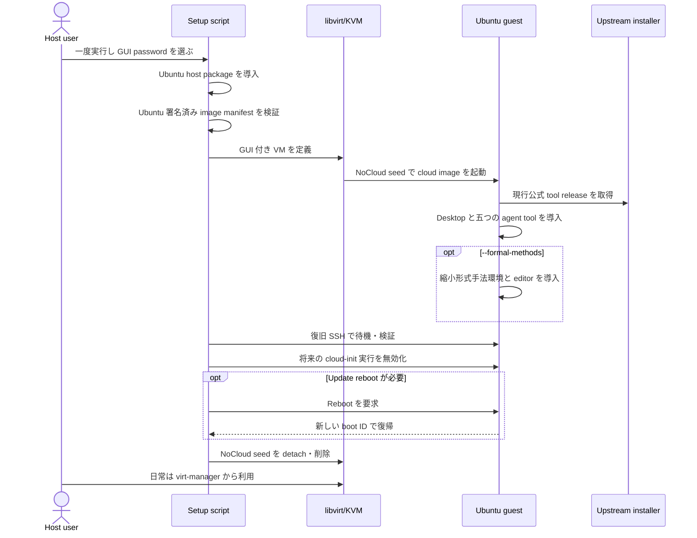

# 設計と信頼境界

[English](design.md)

## なぜ単一スクリプトか

以前の repository は、host 導入、account 作成、image 取得、VM 作成、cloud-init
template、online/offline tool bundle、formal-methods profile、guest helper を
分離していました。多くの制御を明示できる一方、個人利用者が VM を一つ作るだけでも、
実装を理解して複数段階を進む必要がありました。

現在の設計で利用者が実行する操作は一つだけです。

```bash
./setup-kvm-agent.sh
```

内部では今も段階を分け、重要な境界では安全側に失敗しますが、利用者は host
account、設定 file、helper script、provisioning mode の間を移動しません。

## 制御とデータの流れ



Coding-agent installer が script の host process で動くことはありません。
Cloud-init が埋め込み guest provisioning program を VM 内へコピーして実行します。
Host は専用 SSH key で待つため、guest の失敗を成功と誤認しません。

## なぜ cloud image に desktop を追加するのか

Ubuntu Desktop ISO と `virt-manager` installation wizard は手作業で VM を作るには
優れていますが、要求された agent 導入までを一つの unattended command にできません。
Ubuntu Server 公式 cloud image は cloud-init を持ち、GUI installer 画面の自動操作なし
で作れます。その guest へ `ubuntu-desktop-minimal`、GNOME display manager、
`spice-vdagent`、`qemu-guest-agent` を導入します。

結果は日常利用できる通常の GUI 付き Ubuntu でありながら、作成過程を script 化
できます。provisioning 成功後、host はその guest での将来の cloud-init 実行を
無効化します。その後、必要な初回 reboot を行い、kernel boot ID の変化を確認してから、
NoCloud seed を detach して seed file を削除します。

IP address は安定した VM identity ではないため、reboot 後の待機では libvirt の
DHCP lease を再取得します。また、`systemctl reboot` は shutdown 完了前に戻り、古い
boot への SSH が短時間成功し得るため、kernel boot ID が変わることも要求します。
Host 側の待機が中断した場合は、
`setup-kvm-agent.sh --finalize-existing` が同じ内部処理を使い、working VM を
作り直さずに marker 検証、cloud-init 無効化、fail-closed な seed detach を
再実行します。Provisioning 完了は短い non-blocking poll で確認し、各 recovery
SSH 呼び出しにも host 側 timeout を設定します。したがって SSH session や
remote cloud-init command が停止しても、全体の retry limit を無効化できません。

## Disk 容量と将来の cloud adapter

Local の既定は 120 GiB です。GUI 開発 guest、形式手法 toolchain、build product、
agent workspace に余裕を持たせた値です。qcow2 image は thin provisioning のため、
host 上で直ちに 120 GiB を予約しません。ただし setup は host backing storage の
最低空き容量を確認し、qcow2 の virtual size を検証し、Ubuntu の root partition と
filesystem を明示的に拡張します。さらに `/` が要求容量の 90% 以上を公開するまで、
大容量 package 導入を開始しません。

将来の provider adapter すべてに同じ数値を固定すべきではありません。

- AWS EBS gp3 では 120 GiB volume を作れますが、guest が書き込んだ block 数ではなく
  provision した容量に対して課金されます。
- さくらのクラウドは固定 disk plan を公開しており、文書化された選択肢には
  120 GB ではなく 100 GB と 250 GB があります。

したがって将来の AWS・さくら実装では、guest provisioning payload と容量検証は
共有しつつ、VM、network、storage、cleanup は provider 固有 adapter に分けるべきです。
さくらの 100 GB disk でも通常はこの縮小 theorem-proving profile を収容できます。
Project、model weight、dataset により追加容量が必要なら、次の文書化済み plan は
250 GB です。Provider adapter は、すべての backend が 120 GiB を提供したと仮定せず、
実際に provision した容量を guest の検証処理へ渡す必要があります。

## なぜ system libvirt か

Script は、通常 `virt-manager` に表示されるのと同じ `qemu:///system` 接続を使います。
System libvirt には次の利点があります。

- 一つの terminal process から独立して VM を動かし続ける。
- `virt-manager`、`virt-viewer`、`virsh` が同じ VM 一覧を見る。
- VM disk を `/var/lib/libvirt/images` 下で管理する。
- Ubuntu の libvirt service confinement と device permission を使う。
- Host user が logout しても guest を終了しない。

Host user は `libvirt` にのみ追加されます。これは sandbox ではなく管理権限です。
その account は guest を制御できる信頼主体として保ってください。

## Graphics の選択

| Device | 理由 |
|---|---|
| TCP listener を持たない SPICE display（`listen=none`） | libvirt 経由で到達する rich local console。他の local account が接続できる socket が存在しない |
| Virtio video | Linux guest で効率的な graphics |
| USB tablet input | 不自然な mouse capture なしで正確な pointer position |
| `spice-vdagent` | 動的 desktop 連携と clipboard |
| `qemu-guest-agent` | 信頼できる guest report と管理 |
| Serial console | Desktop が起動しない場合の復旧 evidence |

3D acceleration や GPU passthrough は設定しません。そのため、利用者が意図的に VM
hardware と guest 導入を変更しない限り、local Ollama は CPU で動きます。大規模
local model は、明示的に制限した network path を持つ別の GPU server に置く方が
通常は適しています。

## Image の認証

Script は次を download します。

- `SHA256SUMS`
- `SHA256SUMS.gpg`
- 指定された Ubuntu cloud image

`gpgv` が Ubuntu APT repository から導入した cloud-image keyring で manifest を
検証し、その認証済み manifest に対して `sha256sum` が image を検証します。cache
image は、この検証後に作った local 記録値と hash が一致する場合だけ再利用します。

これは Ubuntu image を認証しますが、後に導入される全 package や第三者 agent
release を認証するものではありません。

## Account

| Account | 場所 | 目的 |
|---|---|---|
| 実行した Ubuntu user | Host | 信頼する desktop user、sudo 管理者、libvirt operator |
| `libvirt-qemu` または同等 | Host service | Ubuntu の libvirt 設定下で QEMU を実行 |
| `agent` | Guest | 人間の GUI login、coding-agent 実行、guest 管理 |
| `ollama` | Guest service | Loopback 限定 Ollama server を実行 |

Guest の `agent` は password なし sudo を持ちます。GUI password は不用意な local
login を防ぐためのものであり、その user として既に動く coding agent を制限する
ものではありません。セキュリティ境界は VM です。

実行した host account は `libvirt` にのみ追加され、`kvm` には追加されません。`kvm`
は QEMU service account のための group であり、人間をそこへ入れると、利点なしに VM
disk と cloud-init seed（ゲストパスワードの hash を含む）がその account から読める
ようになります。

VM 管理者 account を分けない理由: この分割は元々 agent を封じ込めるものではあり
ません。封じ込めは KVM が行い、分割の有無で変わりません。分割が変えるのは、*host*
の desktop account が侵害された後に攻撃者が到達する範囲と、非信頼な guest 出力を
描画している console viewer がその瞬間に持っている権限です。作業をすべて guest の
GUI で行えば、その host account の用途が減ります。これは統合を支持する実際の論拠
ですが、統合が無料になるわけではありません。残存リスクと、account を増やさずに
常時有効な権限だけを外す方法は `SECURITY_jp.md` に記載しています。

## 復旧 SSH

Setup script は次を作ります。

```text
~/.local/share/kvm-agent/VM_NAME/id_ed25519
```

Guest へ入るのは public key だけです。Password 認証、root login、SSH agent
forwarding、X11 forwarding は無効です。この key は provisioning status の確認と
GUI が使えない場合の復旧用です。日常作業は完全に `virt-manager` 内だけでも構いません。

Host key は VM ごとの `known_hosts` へ保存します。同じ VM 名の扱いが、他の SSH
接続の global host-key 判断と黙って共有されません。

## Tool 導入方針

Codex、Claude Code、OpenCode、Ollama は現在の公式 native installer channel から
導入します。Aider は guest user として、隔離した `uv` tool environment へ導入します。
Script は各 CLI が version を返すこと、Ollama が guest loopback だけで応答することを
確認します。

任意の `--formal-methods` branch は、復活した provisioning subsystem ではなく、
同じ埋め込み guest program の一部です。Lean/elan、Isabelle2025-2/HOL、
GHCup/GHC/Cabal/HLS/HLint、guest-side VS Code、公式 Lean/Haskell extension だけを
追加します。Isabelle archive には固定の review 済み checksum を使い、他 tool は
現在の公式 channel に従います。

これは release-channel の再現性であり、byte-level の再現性ではありません。通常設定を
小さく保守可能にするため、以前の包括的 profile、package lock、署名済み offline ISO
経路を除去しました。組織的 artifact review が必要な場合は、この個人向け便利経路を
supply-chain 保証と見なさず、内部署名済み golden image を作ってください。

## 意図的に除外した機能

- `vmadmin` と `devui` という別々の host account。
- Offline agent bundle。
- Host/guest shared inbox。
- GitHub fork/deploy-key の自動設定。
- Host への VS Code 自動導入。
- 単一の縮小 opt-in set を超える包括的・選択式 formal-methods profile。
- Host で強制される network policy。private network の遮断は guest firewall であり、libvirt `nwfilter` ではありません。
- GPU/USB passthrough。
- VM の自動破棄。

特定組織では有用なものもありますが、GUI 付き交換可能 agent VM の作成・運用には
必須ではありません。
