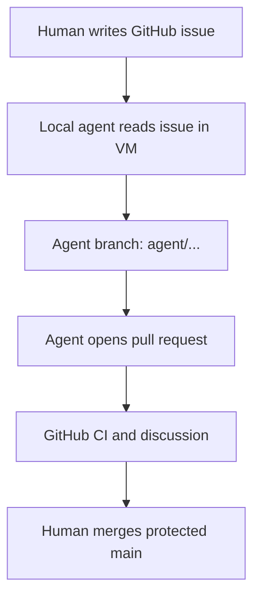

# GitHub integration for a local coding-agent VM

[日本語版](github-integration_jp.md)

This guide turns a private GitHub repository into the coordination and review
surface for Claude Code, Codex, OpenCode, Aider, or another coding agent that
runs locally inside a KVM-Agent guest. GitHub stores the durable project record;
the VM supplies the mutable build and execution environment.

The worked example uses:

| Item | Example | Replace when reusing the guide |
|---|---|---|
| Repository | `yutakang/abduction-engine` | `OWNER/REPOSITORY` |
| Local directory | `~/Work/abduction-engine` | your guest path |
| SSH host alias | `github-abduction` | a unique alias per deploy key |
| Deploy-key file | `~/.ssh/abduction-engine_ed25519` | a unique key per repository |
| API-token file | `~/.config/abduction-agent/github-token` | a project-specific path |

Do not paste a real token into an issue, prompt, repository file, screenshot, or
command-line argument. Commands below show paths and placeholders only.

## Repository, Project, and organization are different things

- A **repository** holds code, branches, commits, pull requests, issues,
  Actions workflows, rulesets, and repository settings. Create this first.
- A GitHub **Project** is an optional planning board over issues and pull
  requests. It does not replace a repository and is unnecessary for the first
  issue-to-pull-request cycle.
- An **organization** is an ownership and policy container for multiple people
  or repositories. A solo private project can remain under a personal account.
  Move to an organization later if team roles, shared billing, organization-wide
  secrets, or centralized policy become useful.

GitHub Pro is sufficient for the personal private-repository workflow described
here. GitHub Copilot cloud-agent features are a separate entitlement; do not
assume that GitHub Pro by itself enables them.

## What lives where

| GitHub | Local agent VM |
|---|---|
| Private canonical repository | Working tree and uncommitted edits |
| `main` and short-lived feature branches | Compilers, Isabelle, language servers, and caches |
| Issues with acceptance criteria | Claude Code, Codex, OpenCode, Aider, and local models |
| Pull requests, review discussion, and merge record | Builds, tests, proof search, and experiments |
| CI results, release tags, and durable documentation | Project-scoped SSH key and API token |
| Pinned public references, for example a submodule | Temporary logs and generated artifacts not intended for Git |

Do not upload provider login state, API keys, browser profiles, unrestricted
SSH keys, build caches, or confidential scratch data to GitHub. Do not rely on
the VM as the only copy of an accepted commit or design decision.

## Authority model

Use two separate credentials because Git transport and GitHub's issue/PR API
are different authority surfaces.

| Credential | Purpose | Recommended scope |
|---|---|---|
| Repository deploy key | `git fetch` and pushes to agent branches | This repository only; write enabled |
| Fine-grained personal access token | Read/write issues and create/update pull requests with `gh` | This repository only; Contents read-only, Issues read/write, Pull requests read/write |

The deploy key can push branches, but the `main` ruleset rejects direct pushes.
The API token can coordinate issues and pull requests, but Contents read-only
does not authorize the pull-request merge API. GitHub documents Contents write
as a requirement for that endpoint. The human owner reviews and merges.

This separation is deliberate. Private repository visibility protects against
the public; it does not make an autonomous process infallible or prevent a
stolen credential from being used.

## End-to-end flow



Creating an issue does **not** wake Claude Code, Codex, or OpenCode running on a
local VM. Start the CLI yourself and give it the issue number, or add a separate
audited scheduler later. A GitHub-hosted Copilot cloud agent is different: when
that feature is available and enabled, assigning an issue to Copilot can start a
GitHub-hosted session and produce a pull request.

## Part 1: create and protect the GitHub repository

### 1. Create the repository

On GitHub, choose **New repository** and set:

- owner: your personal account, unless an organization is already needed;
- visibility: **Private**;
- Issues: enabled;
- default branch: `main`; and
- no template files if an existing local history will be pushed, or a minimal
  `README` if GitHub is the starting point.

For a new project, starting on GitHub and cloning into the VM is the least
surprising path: the remote exists first, the first local branch tracks it, and
there is no unrelated-history reconciliation.

### 2. Create the minimal `main` ruleset

Open the repository, then **Settings → Rules → Rulesets → New ruleset → New
branch ruleset**. GitHub changes labels occasionally; use the rule names, not a
screenshot, as the durable checklist.

Set:

| Setting | Initial value |
|---|---|
| Enforcement status | Active |
| Target branches | Default branch |
| Bypass list | Empty |
| Restrict deletions | On |
| Require a pull request before merging | On |
| Required approvals | `0` for a solo owner |
| Require conversation resolution | On |
| Block force pushes | On |

Do not require a status check until the repository has a real workflow and that
check has completed at least once. Then edit the ruleset and require the stable
check name. Otherwise the first pull request can become impossible to merge.

With zero approvals, the pull request is still a mandatory review surface and
history boundary; the owner performs the review and merge. Increase the approval
count when another human reviewer is available.

### 3. Keep GitHub Actions conservative

Add a workflow only after one build/test command works locally. Prefer:

```yaml
permissions:
  contents: read
```

Pin third-party actions to reviewed commit SHAs for sensitive projects, avoid
`pull_request_target` for untrusted changes, and do not add repository secrets
until a workflow demonstrably needs them. The VM's `GH_TOKEN` and model-provider
credentials do not belong in Actions secrets.

## Part 2: install a current GitHub CLI in the VM

Current KVM-Agent provisioning installs `gh` from GitHub's official APT
repository and verifies the downloaded keyring against the checksum reviewed by
this repository. On a newly created guest, begin with `gh --version` and skip
the manual installation below when it succeeds.

Ubuntu's distribution package can lag behind GitHub. Older `gh` releases have
failed on `gh issue view` because they queried the retired Projects Classic
`projectCards` field. Install the official GitHub CLI APT repository inside the
guest when upgrading an older KVM-Agent VM or repairing a missing installation.

First inspect GitHub CLI's current official Linux instructions and published
signing-key fingerprints from a trusted browser. Then, in the guest:

```bash
sudo apt update
sudo apt install wget
sudo mkdir -p -m 755 /etc/apt/keyrings

wget -O /tmp/githubcli-archive-keyring.gpg \
  https://cli.github.com/packages/githubcli-archive-keyring.gpg
sudo cp /tmp/githubcli-archive-keyring.gpg \
  /etc/apt/keyrings/githubcli-archive-keyring.gpg
sudo chmod go+r /etc/apt/keyrings/githubcli-archive-keyring.gpg

echo "deb [arch=$(dpkg --print-architecture) signed-by=/etc/apt/keyrings/githubcli-archive-keyring.gpg] https://cli.github.com/packages stable main" \
  | sudo tee /etc/apt/sources.list.d/github-cli.list

sudo apt update
sudo apt install gh
gh --version
```

`tee` reads the repository line from standard input and writes it to the
root-owned file named after it. `sudo echo ... > FILE` would not work reliably
because the shell performs `>` before `sudo` applies. The command intentionally
prints the line it wrote; redirecting to `/dev/null` would merely hide that
copy of the output and is unnecessary.

## Part 3: configure repository-scoped Git transport

### 1. Generate a dedicated key inside the guest

```bash
mkdir -p ~/.ssh
chmod 700 ~/.ssh
ssh-keygen -t ed25519 \
  -f ~/.ssh/abduction-engine_ed25519 \
  -C "deploy key for yutakang/abduction-engine"
chmod 600 ~/.ssh/abduction-engine_ed25519
chmod 644 ~/.ssh/abduction-engine_ed25519.pub
```

A passphrase is preferable when a human can unlock the key for each work
session. An empty passphrase permits unattended branch pushes but makes possession
of the VM file sufficient to use the key. Choose deliberately and keep this VM
within one project trust domain.

Display only the public half for copying:

```bash
cat ~/.ssh/abduction-engine_ed25519.pub
```

On GitHub, open **Repository → Settings → Deploy keys → Add deploy key**, paste
the public key, give it a recognizable title, and select **Allow write access**.
A deploy key is repository-scoped and is not the same as an account-wide SSH
key.

### 2. Give the key a unique SSH alias

Edit `~/.ssh/config` and add:

```sshconfig
Host github-abduction
    HostName github.com
    User git
    IdentityFile ~/.ssh/abduction-engine_ed25519
    IdentitiesOnly yes
    ForwardAgent no
```

Then protect the configuration:

```bash
chmod 600 ~/.ssh/config
```

Before accepting GitHub's host key for the first time, compare the displayed
fingerprint with GitHub's currently published SSH fingerprints on a trusted
device. Then test:

```bash
ssh -T git@github-abduction
```

For a deploy key, this success message is normal:

```text
Hi OWNER/REPOSITORY! You've successfully authenticated, but GitHub does not provide shell access.
```

It means authentication succeeded and interactive shell service is intentionally
unavailable. It does not mean that a command failed.

### 3. Clone or repair the remote

For a new local checkout:

```bash
mkdir -p ~/Work
cd ~/Work
git clone git@github-abduction:yutakang/abduction-engine.git
cd abduction-engine
```

For an existing checkout:

```bash
cd ~/Work/abduction-engine
git remote set-url origin \
  git@github-abduction:yutakang/abduction-engine.git
```

Verify:

```bash
git remote -v
git fetch origin
git status
```

`git remote -v` shows which endpoint Git uses to fetch and push; it does not
contact GitHub. `git fetch` downloads remote commits and updates remote-tracking
names without changing checked-out files. `git pull` normally fetches and then
merges or rebases into the current branch. Agents should usually inspect after
`fetch` and use `pull --ff-only` when a fast-forward is intended.

## Part 4: configure narrowly scoped issue and PR access

### 1. Create a fine-grained personal access token

This human-only step handles the secret. In GitHub's personal settings, open
**Developer settings → Personal access tokens → Fine-grained tokens → Generate
new token**. If **Developer settings** is not visible, verify that you opened
your personal account settings, not a repository's Settings page.

Choose:

- a clear name and a short expiration;
- resource owner: the repository owner;
- repository access: **Only select repositories**;
- selected repository: `abduction-engine`; and
- under **Permissions**, click **Add permissions**, then add only the rows below.

| Repository permission | Access |
|---|---|
| Metadata | Read-only; added automatically |
| Contents | Read-only |
| Issues | Read and write |
| Pull requests | Read and write |

Leave Administration, Actions, Workflows, Secrets, Webhooks, and all account
permissions at no access. Actions or commit-status read access can be added
later only if the local agent must inspect CI through the API.

The token represents the human account in issue and pull-request history even
though its authority is narrower. Review the audit trail accordingly.

### 2. Put the token in a protected project-specific file

Create the empty file without placing the token in shell history:

```bash
mkdir -p ~/.config/abduction-agent
chmod 700 ~/.config/abduction-agent
touch ~/.config/abduction-agent/github-token
chmod 600 ~/.config/abduction-agent/github-token
nano ~/.config/abduction-agent/github-token
```

Paste the token as the file's only line, save, and exit. `touch` merely creates
an empty file if it does not exist. No software is being installed by these
commands.

For a dedicated, single-project VM, it is reasonable to load this narrow token
for every interactive Bash session. Add the following non-secret block to
`~/.bashrc`; a coding agent may make this small edit because the token value is
not part of the edit:

```bash
# GitHub API access for the Abduction Engine agent workflow.
if [[ -r "$HOME/.config/abduction-agent/github-token" ]]; then
    export GH_TOKEN="$(< "$HOME/.config/abduction-agent/github-token")"
fi
```

Open a new terminal, or load the edited file into the current shell:

```bash
source ~/.bashrc
```

An `export` typed once lasts only for that shell and its child processes. The
`.bashrc` block recreates `GH_TOKEN` in each new interactive Bash session. Start
the coding agent **after** loading it; an already-running process does not gain
later environment changes.

On a multi-project VM, do not load every token globally. Use one wrapper per
project or launch the agent from a project-specific shell instead.

### 3. Verify API access without exposing the token

```bash
gh auth status
gh repo view yutakang/abduction-engine
gh issue list --repo yutakang/abduction-engine
```

Never run `echo "$GH_TOKEN"`, enable shell tracing while loading it, or ask an
agent to print environment variables.

## Part 5: establish the daily issue-to-PR contract

### 1. Write an implementation issue

An agent-ready issue should include:

- objective and context;
- exact repository paths or upstream references;
- acceptance criteria;
- build/test commands;
- constraints and explicit non-goals;
- provenance and licensing requirements for imported public code; and
- the rule: do not commit or push directly to `main`, and do not merge the PR.

For a public Isabelle reference, prefer a pinned HTTPS submodule over copying a
floating snapshot. For example, an issue can ask the agent to add
`https://github.com/data61/PSL.git` at
`reference/isabelle-abduction-prover`, check out a reviewed tag or commit, and
record the upstream URL, immutable commit, release/tag, Isabelle version, and
license. Treat that tree as read-only reference material.

### 2. Start the local agent manually

```bash
cd ~/Work/abduction-engine
tmux new -As work
```

Then start one agent and give it a bounded instruction such as:

```text
Implement GitHub issue #1 in this repository. Read it with gh, inspect the
repository instructions, create an agent/... branch from current origin/main,
make the smallest suitable change, run the documented checks, commit and push
the branch, and open a pull request containing Closes #1. Do not push directly
to main and do not merge the pull request. Never display credentials.
```

The agent can read the issue with:

```bash
gh issue view 1 --repo yutakang/abduction-engine
```

If an old `gh` reports a Projects Classic `projectCards` GraphQL error, update
from the official GitHub CLI repository. Temporary data-only fallbacks are:

```bash
gh issue view 1 \
  --repo yutakang/abduction-engine \
  --json number,title,body,url

gh api repos/yutakang/abduction-engine/issues/1 \
  --jq '"#\(.number) \(.title)\n\n\(.body)"'
```

### 3. Agent branch, validation, and PR

A typical agent sequence is:

```bash
git fetch origin
git switch main
git pull --ff-only origin main
git switch -c agent/import-isabelle-reference

# edit and run the repository's documented checks

git status --short
git diff --check
git diff
git add PATHS_REVIEWED_BY_THE_AGENT
git diff --cached
git commit -m "Import pinned Isabelle reference"
git push -u origin agent/import-isabelle-reference

gh pr create \
  --repo yutakang/abduction-engine \
  --base main \
  --head agent/import-isabelle-reference \
  --title "Import pinned Isabelle reference" \
  --body "Closes #1"
```

The agent must inspect any untracked names reported by `git status`, replace the
placeholder path list, and write a useful PR body with summary, checks, risks,
provenance, and remaining work. `git add .` is not the recommended default
because it can stage unrelated files or secrets.

If GitHub shows **Compare & pull request**, the branch push succeeded but no PR
exists yet. The local agent can and normally should run `gh pr create`; the
banner is a convenience, not a required human step.

### 4. Human review and merge

The owner reviews on GitHub:

- all changed files and unexpected generated content;
- test and Actions results;
- unresolved conversations;
- dependency, license, and submodule provenance;
- the exact submodule commit rather than only `.gitmodules`; and
- whether the PR stays within the issue's scope.

Request changes or push follow-up commits on the same agent branch. When the
result is acceptable, the human merges through GitHub. `Closes #1` in the PR
body closes the issue when the PR reaches the default branch.

After merge, in the VM:

```bash
git switch main
git pull --ff-only origin main
git branch -d agent/import-isabelle-reference
git fetch --prune origin
```

Delete the remote feature branch through the merge UI or with a reviewed Git
command. Never force-push `main`.

## Optional GitHub-hosted AI

If the account has an eligible paid GitHub Copilot plan and Copilot cloud agent
is enabled for the repository, assigning an issue to Copilot can start work in
a GitHub Actions-powered environment and raise a pull request. This is separate
from local Claude Code, Codex, or OpenCode:

| Local VM agent | GitHub Copilot cloud agent |
|---|---|
| Started manually in the guest | Can start from a GitHub assignment or automation |
| Uses the VM's tools and project-scoped credentials | Uses a GitHub-hosted ephemeral environment |
| Can use locally installed Isabelle and private caches | Needs repository setup steps and explicit agent secrets/variables |
| Network and filesystem follow VM policy | Network follows GitHub agent/firewall policy |

Reuse the same issues, repository instructions, PR review, CI, and protected
`main`. Do not copy the VM's PAT, deploy private key, or model-provider token
into GitHub agent secrets. Add a secret to **Settings → Secrets and variables →
Agents** only when a cloud-agent task truly requires it, and scope it separately.

## Troubleshooting and recovery

### `ssh -T` says GitHub does not provide shell access

That is the expected success message. Confirm that it names the intended
repository. If it names another repository or account, inspect `~/.ssh/config`,
the `IdentityFile`, and `IdentitiesOnly yes`.

### Push to `main` is rejected

This is the expected result of the ruleset. Switch to a feature branch, push
that branch, and open a PR. Do not add the deploy key or agent identity to a
bypass list.

### `gh` works in one terminal but not a newly started agent

Check that the token file is readable only by the user, the `.bashrc` block is
present, and the agent was started after `source ~/.bashrc` or in a new terminal:

```bash
stat -c '%a %n' ~/.config/abduction-agent \
  ~/.config/abduction-agent/github-token
test -n "${GH_TOKEN:-}" && echo "GH_TOKEN is loaded"
```

Expected modes are `700` for the directory and `600` for the token. The final
check reports only whether the variable is present; it does not print it.

### Revoke a lost or over-scoped credential

From a separate trusted device:

1. revoke the fine-grained PAT in personal Developer settings;
2. remove the deploy key under repository Settings;
3. stop or disconnect the VM;
4. inspect repository audit/history, branches, PRs, issues, and Actions runs;
5. rotate any other credential exposed to that guest; and
6. rebuild from a credential-free snapshot if compromise is plausible.

Review and renew expiring credentials intentionally. Do not solve expiration by
creating a non-expiring, account-wide token.

## Maintainer checklist

- [ ] Repository is private and Issues are enabled.
- [ ] Active default-branch ruleset requires PRs and blocks deletion/force push.
- [ ] No agent or deploy key is in the ruleset bypass list.
- [ ] Deploy key is unique to this repository and its private half stays in the VM.
- [ ] Fine-grained PAT selects one repository and uses the four permission rows above.
- [ ] Token file is mode `600`; its directory is mode `700`.
- [ ] `gh`, SSH fetch, feature-branch push, and PR creation have been tested.
- [ ] Agent instructions prohibit direct `main` pushes, merges, and credential display.
- [ ] CI uses least privilege and required checks are enabled only after they exist.
- [ ] Human review includes dependencies, licenses, and pinned submodule commits.

See [Credential handling](credentials.md), [Daily operation](daily-use.md), and
[Primary upstream references](references.md) for the surrounding trust model and
current authoritative links.
