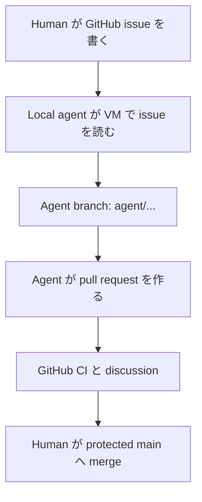

# Local coding-agent VM の GitHub integration

[English](github-integration.md)

この guide は、private GitHub repository を、KVM-Agent guest 内で動く Claude Code、
Codex、OpenCode、Aider その他の coding agent の coordination・review 面として使うための
ものです。GitHub は project の永続記録を保持し、VM は変更可能な build・execution
environment を提供します。

具体例では次の名前を使います。

| 項目 | 例 | 再利用時の置換先 |
|---|---|---|
| Repository | `yutakang/abduction-engine` | `OWNER/REPOSITORY` |
| Local directory | `~/Work/abduction-engine` | guest 内の path |
| SSH host alias | `github-abduction` | deploy key ごとに固有の alias |
| Deploy-key file | `~/.ssh/abduction-engine_ed25519` | repository ごとに固有の key |
| API-token file | `~/.config/abduction-agent/github-token` | project 固有の path |

本物の token を issue、prompt、repository file、screenshot、command-line argument
へ貼り付けてはいけません。以下の command は path と placeholder だけを示します。

## Repository、Project、organization の違い

- **Repository** は code、branch、commit、pull request、issue、Actions workflow、
  ruleset、repository 設定を保持します。最初に作るのはこれです。
- GitHub **Project** は issue・pull request を整理する任意の planning board です。
  Repository の代わりではなく、最初の issue-to-PR cycle には不要です。
- **Organization** は複数人・複数 repository の ownership と policy をまとめる
  container です。一人の private project は personal account 配下で開始できます。
  Team role、shared billing、organization-wide secret、中央 policy が必要になった時点で
  organization へ移すことを検討できます。

ここで説明する personal private-repository workflow には GitHub Pro で十分です。
GitHub Copilot cloud agent は別の entitlement です。GitHub Pro だけで有効になると
仮定しないでください。

## どちらに何を置くか

| GitHub | Local agent VM |
|---|---|
| Private canonical repository | Working tree と未 commit の編集 |
| `main` と短命 feature branch | Compiler、Isabelle、language server、cache |
| Acceptance criteria を持つ issue | Claude Code、Codex、OpenCode、Aider、local model |
| Pull request、review discussion、merge record | Build、test、proof search、experiment |
| CI result、release tag、永続文書 | Project 限定 SSH key と API token |
| Pin した public reference（例: submodule） | Git に入れない一時 log・生成物 |

Provider login state、API key、browser profile、無制限 SSH key、build cache、機密
scratch data を GitHub へ upload しません。Accepted commit や設計判断の唯一の copy を
VM だけに置きません。

## Authority model

Git transport と GitHub の issue/PR API は別の authority 面なので、二つの credential
を分けます。

| Credential | 用途 | 推奨 scope |
|---|---|---|
| Repository deploy key | `git fetch` と agent branch への push | この repository だけ、write enabled |
| Fine-grained personal access token | `gh` による issue read/write と PR create/update | この repository だけ、Contents read-only、Issues read/write、Pull requests read/write |

Deploy key は branch を push できますが、`main` ruleset が direct push を拒否します。
API token は issue・PR を操作できますが、Contents read-only では pull-request merge API
を認可しません。GitHub の同 endpoint は Contents write を要求します。Human owner が
review・merge します。

この分離は意図的です。Private visibility は public から project を守りますが、
autonomous process の誤りや credential 窃取を無効にはしません。

## End-to-end flow



Issue を作っただけでは、local VM 上の Claude Code、Codex、OpenCode は起動しません。
自分で CLI を開始して issue number を渡すか、後で別の audit 済み scheduler を追加します。
GitHub-hosted Copilot cloud agent は別物です。その機能が利用可能かつ有効なら、Copilot
への issue assignment が GitHub-hosted session を開始して PR を作成できます。

## Part 1: GitHub repository を作成・保護する

### 1. Repository を作る

GitHub で **New repository** を選び、次を設定します。

- owner: organization が既に必要でなければ personal account。
- visibility: **Private**。
- Issues: enabled。
- default branch: `main`。
- 既存 local history を push するなら template file なし。GitHub を起点にするなら
  最小 `README`。

新規 project は、GitHub で作成してから VM へ clone するのが最も単純です。Remote が
先に存在し、最初の local branch が tracking し、unrelated history の調整が不要です。

### 2. 最小 `main` ruleset を作る

Repository の **Settings → Rules → Rulesets → New ruleset → New branch
ruleset** を開きます。GitHub は label を変更することがあるため、screenshot ではなく
次の rule name を checklist とします。

| Setting | 初期値 |
|---|---|
| Enforcement status | Active |
| Target branches | Default branch |
| Bypass list | 空 |
| Restrict deletions | On |
| Require a pull request before merging | On |
| Required approvals | 一人 owner なら `0` |
| Require conversation resolution | On |
| Block force pushes | On |

Repository に実際の workflow ができ、その check が最低一度成功するまでは required
status check にしません。その後 ruleset を編集し、安定した check name を required に
します。先に要求すると最初の PR を merge 不能にすることがあります。

Approval が 0 でも、PR は必須 review 面と history boundary です。Owner が review・merge
します。別の human reviewer が参加した時点で approval 数を増やします。

### 3. GitHub Actions を保守的にする

一つの build/test command が local で動いてから workflow を追加します。原則として
次を指定します。

```yaml
permissions:
  contents: read
```

機密 project の third-party action は review 済み commit SHA へ pin し、非信頼変更に
`pull_request_target` を使わず、workflow が必要とするまで repository secret を追加
しません。VM の `GH_TOKEN` と model-provider credential を Actions secret へコピー
しません。

## Part 2: VM に current GitHub CLI を導入する

Current KVM-Agent provisioning は `gh` を GitHub の公式 APT repository から導入し、
download した keyring をこの repository で review 済み checksum に対して検証します。
新しく作った guest では最初に `gh --version` を実行し、成功するなら以下の manual
installation を省略します。

Ubuntu distribution package は GitHub より遅れる場合があります。古い `gh` では、廃止
された Projects Classic の `projectCards` field を問い合わせ、`gh issue view` が失敗
した版がありました。古い KVM-Agent VM の upgrade または missing installation の修復時
に、guest 内で GitHub CLI 公式 APT repository を使います。

最初に、信頼する browser から GitHub CLI の現在の Linux instruction と公開 signing-key
fingerprint を確認します。その後 guest で実行します。

```bash
sudo apt update
sudo apt install wget
sudo mkdir -p -m 755 /etc/apt/keyrings

wget -O /tmp/githubcli-archive-keyring.gpg \
  https://cli.github.com/packages/githubcli-archive-keyring.gpg
sudo cp /tmp/githubcli-archive-keyring.gpg \
  /etc/apt/keyrings/githubcli-archive-keyring.gpg
sudo chmod go+r /etc/apt/keyrings/githubcli-archive-keyring.gpg

echo "deb [arch=$(dpkg --print-architecture) signed-by=/etc/apt/keyrings/githubcli-archive-keyring.gpg] https://cli.github.com/packages stable main" \
  | sudo tee /etc/apt/sources.list.d/github-cli.list

sudo apt update
sudo apt install gh
gh --version
```

`tee` は標準入力から repository line を読み、後ろに指定した root-owned file へ書きます。
`sudo echo ... > FILE` では shell が `sudo` より前に `>` を処理するため、確実に書けません。
Command が書いた line を表示するのは意図どおりです。`/dev/null` への redirect はその
表示 copy を隠すだけなので不要です。

## Part 3: repository-scoped Git transport を設定する

### 1. Guest 内で専用 key を作る

```bash
mkdir -p ~/.ssh
chmod 700 ~/.ssh
ssh-keygen -t ed25519 \
  -f ~/.ssh/abduction-engine_ed25519 \
  -C "deploy key for yutakang/abduction-engine"
chmod 600 ~/.ssh/abduction-engine_ed25519
chmod 644 ~/.ssh/abduction-engine_ed25519.pub
```

Human が session ごとに unlock できるなら passphrase を推奨します。空 passphrase は
unattended branch push を可能にしますが、VM 内 file を取得した者が key を使えます。
意図的に選び、この VM を一つの project trust domain に保ちます。

Copy 用には public half だけを表示します。

```bash
cat ~/.ssh/abduction-engine_ed25519.pub
```

GitHub の **Repository → Settings → Deploy keys → Add deploy key** を開き、public
key を貼り、識別可能な title を付けて **Allow write access** を選びます。Deploy key
は repository-scoped であり、account-wide SSH key とは違います。

### 2. Key に固有 SSH alias を与える

`~/.ssh/config` へ追加します。

```sshconfig
Host github-abduction
    HostName github.com
    User git
    IdentityFile ~/.ssh/abduction-engine_ed25519
    IdentitiesOnly yes
    ForwardAgent no
```

Configuration を保護します。

```bash
chmod 600 ~/.ssh/config
```

初回に GitHub host key を accept する前に、表示 fingerprint を信頼端末で GitHub の
現在の公開 SSH fingerprint と比較します。その後 test します。

```bash
ssh -T git@github-abduction
```

Deploy key では次の success message が正常です。

```text
Hi OWNER/REPOSITORY! You've successfully authenticated, but GitHub does not provide shell access.
```

Authentication 成功と interactive shell service 非提供を意味し、command failure では
ありません。

### 3. Clone または remote 修正

新しい local checkout:

```bash
mkdir -p ~/Work
cd ~/Work
git clone git@github-abduction:yutakang/abduction-engine.git
cd abduction-engine
```

既存 checkout:

```bash
cd ~/Work/abduction-engine
git remote set-url origin \
  git@github-abduction:yutakang/abduction-engine.git
```

確認:

```bash
git remote -v
git fetch origin
git status
```

`git remote -v` は fetch・push に使う endpoint を表示するだけで、GitHub へ接続しません。
`git fetch` は remote commit と remote-tracking name を取得しますが checkout file を変更
しません。`git pull` は通常、fetch 後に current branch へ merge または rebase します。
Agent は `fetch` 後に内容を確認し、fast-forward を意図するとき `pull --ff-only` を使う
のが安全です。

## Part 4: scope を絞った issue・PR access を設定する

### 1. Fine-grained personal access token を作る

Secret を扱うこの段階だけは human が行います。GitHub personal settings の
**Developer settings → Personal access tokens → Fine-grained tokens → Generate
new token** を開きます。**Developer settings** が見えなければ、repository Settings
ではなく personal account settings を開いているか確認します。

次を選びます。

- 明確な name と短い expiration。
- Resource owner: repository owner。
- Repository access: **Only select repositories**。
- Selected repository: `abduction-engine`。
- **Permissions** で **Add permissions** を押し、次の row だけを追加。

| Repository permission | Access |
|---|---|
| Metadata | Read-only。自動追加 |
| Contents | Read-only |
| Issues | Read and write |
| Pull requests | Read and write |

Administration、Actions、Workflows、Secrets、Webhooks、account permission は no access
のままにします。Local agent が API 経由で CI を調べる必要が生じた場合だけ、Actions
または commit-status read access を後から追加します。

Authority を絞っても、issue・PR history では token は human account を表します。その
前提で audit trail を review してください。

### 2. Token を保護した project-specific file へ置く

Token を shell history へ入れず、空 file を作ります。

```bash
mkdir -p ~/.config/abduction-agent
chmod 700 ~/.config/abduction-agent
touch ~/.config/abduction-agent/github-token
chmod 600 ~/.config/abduction-agent/github-token
nano ~/.config/abduction-agent/github-token
```

Token を唯一の line として貼り、保存・終了します。`touch` は file がなければ空 file を
作るだけです。これらの command は software を install していません。

一つの project 専用 VM なら、狭い token を interactive Bash session ごとに読む運用は
妥当です。次の非 secret block を `~/.bashrc` へ追加します。Token 値を扱わない小さな
編集なので coding agent に任せても構いません。

```bash
# GitHub API access for the Abduction Engine agent workflow.
if [[ -r "$HOME/.config/abduction-agent/github-token" ]]; then
    export GH_TOKEN="$(< "$HOME/.config/abduction-agent/github-token")"
fi
```

新 terminal を開くか、current shell へ読み込みます。

```bash
source ~/.bashrc
```

一度入力した `export` は、その shell と child process にだけ残ります。`.bashrc` block
は新しい interactive Bash session ごとに `GH_TOKEN` を再作成します。Coding agent は
読み込み**後**に開始します。既に動いている process は後の environment 変更を受けません。

Multi-project VM では全 token を global に読みません。Project ごとの wrapper または
project-specific shell から agent を起動します。

### 3. Token を表示せず API access を確認する

```bash
gh auth status
gh repo view yutakang/abduction-engine
gh issue list --repo yutakang/abduction-engine
```

`echo "$GH_TOKEN"`、load 中の shell trace、有効 environment 全体を agent に表示させる
ことをしてはいけません。

## Part 5: 日常 issue-to-PR contract を定める

### 1. Implementation issue を書く

Agent-ready issue には次を含めます。

- Objective と context。
- 正確な repository path または upstream reference。
- Acceptance criteria。
- Build/test command。
- Constraint と明示した non-goal。
- Public code import の provenance・license requirement。
- `main` へ直接 commit/push せず、PR を merge しないという rule。

Public Isabelle reference には floating snapshot の copy より pin 済み HTTPS submodule を
優先します。例えば issue で `https://github.com/data61/PSL.git` を
`reference/isabelle-abduction-prover` へ追加し、review 済み tag または commit を
checkout し、upstream URL、immutable commit、release/tag、Isabelle version、license
を記録するよう依頼できます。この tree は read-only reference material と扱います。

### 2. Local agent を手動で開始する

```bash
cd ~/Work/abduction-engine
tmux new -As work
```

一つの agent を起動し、例えば次の bounded instruction を渡します。

```text
この repository の GitHub issue #1 を実装してください。gh で issue を読み、repository
instruction を確認し、current origin/main から agent/... branch を作り、最小の適切な変更を
行い、文書化された check を実行し、commit・push して Closes #1 を含む pull request を
作ってください。main へ直接 push せず、pull request を merge しないでください。
Credential を表示してはいけません。
```

Agent は次で issue を読めます。

```bash
gh issue view 1 --repo yutakang/abduction-engine
```

古い `gh` が Projects Classic `projectCards` GraphQL error を出すなら、GitHub CLI 公式
repository から update します。一時的な data-only fallback は次です。

```bash
gh issue view 1 \
  --repo yutakang/abduction-engine \
  --json number,title,body,url

gh api repos/yutakang/abduction-engine/issues/1 \
  --jq '"#\(.number) \(.title)\n\n\(.body)"'
```

### 3. Agent branch、validation、PR

典型的な agent sequence:

```bash
git fetch origin
git switch main
git pull --ff-only origin main
git switch -c agent/import-isabelle-reference

# edit and run the repository's documented checks

git status --short
git diff --check
git diff
git add PATHS_REVIEWED_BY_THE_AGENT
git diff --cached
git commit -m "Import pinned Isabelle reference"
git push -u origin agent/import-isabelle-reference

gh pr create \
  --repo yutakang/abduction-engine \
  --base main \
  --head agent/import-isabelle-reference \
  --title "Import pinned Isabelle reference" \
  --body "Closes #1"
```

Agent は `git status` が示した untracked name を調べ、placeholder path list を置換し、
summary、check、risk、provenance、remaining work を含む useful PR body を書きます。
`git add .` は unrelated file や secret まで stage し得るため既定にしません。

GitHub が **Compare & pull request** を表示するなら、branch push は成功しましたが PR
がまだないという意味です。Local agent は通常 `gh pr create` まで実行できます。Banner
は便宜機能であり human に必須の作業ではありません。

### 4. Human review・merge

Owner は GitHub 上で次を review します。

- 全 changed file と予期しない生成物。
- Test・Actions result。
- 未解決 conversation。
- Dependency、license、submodule provenance。
- `.gitmodules` だけでなく正確な submodule commit。
- PR が issue scope 内か。

変更を request するか、同じ agent branch に follow-up commit を push させます。Accept
できた時点で human が GitHub から merge します。PR body の `Closes #1` は default
branch へ merge されたとき issue を close します。

Merge 後、VM で:

```bash
git switch main
git pull --ff-only origin main
git branch -d agent/import-isabelle-reference
git fetch --prune origin
```

Remote feature branch は merge UI または review 済み Git command で削除します。`main`
を force-push しません。

## 任意の GitHub-hosted AI

Account に対象の paid GitHub Copilot plan があり、repository で Copilot cloud agent が
enabled なら、Copilot へ issue を assign することで GitHub Actions-powered environment
で作業を開始し PR を作成できます。Local Claude Code、Codex、OpenCode とは別です。

| Local VM agent | GitHub Copilot cloud agent |
|---|---|
| Guest で手動開始 | GitHub assignment・automation から開始可能 |
| VM の tool と project-scoped credential を使用 | GitHub-hosted ephemeral environment を使用 |
| Local Isabelle と private cache を使用可能 | Repository setup step と明示的 agent secret/variable が必要 |
| Network・filesystem は VM policy に従う | Network は GitHub agent/firewall policy に従う |

Issue、repository instruction、PR review、CI、protected `main` は共通化できます。VM の
PAT、deploy private key、model-provider token を GitHub agent secret へコピーしません。
Cloud-agent task が本当に必要とする secret だけを **Settings → Secrets and variables →
Agents** へ別 scope で追加します。

## Troubleshooting・recovery

### `ssh -T` が GitHub does not provide shell access と言う

これは期待する success message です。目的の repository 名が表示されることを確認します。
別 repository/account が表示されたら `~/.ssh/config`、`IdentityFile`、
`IdentitiesOnly yes` を調べます。

### `main` への push が拒否される

Ruleset の期待どおりの動作です。Feature branch へ切り替え、その branch を push して
PR を作ります。Deploy key・agent identity を bypass list へ追加しません。

### 一つの terminal では `gh` が動くが、新しく開始した agent では動かない

Token file permission、`.bashrc` block、agent が `source ~/.bashrc` 後または新 terminal
で開始されたかを確認します。

```bash
stat -c '%a %n' ~/.config/abduction-agent \
  ~/.config/abduction-agent/github-token
test -n "${GH_TOKEN:-}" && echo "GH_TOKEN is loaded"
```

Directory は `700`、token は `600` が期待値です。最後の check は variable の有無だけを
報告し、値を表示しません。

### Lost・over-scoped credential を revoke する

別の信頼端末から:

1. Personal Developer settings で fine-grained PAT を revoke。
2. Repository Settings で deploy key を削除。
3. VM を stop または disconnect。
4. Repository audit/history、branch、PR、issue、Actions run を確認。
5. 同 guest に露出した他 credential を rotate。
6. Compromise があり得るなら credential-free snapshot から rebuild。

Expiry を意図的に review・renew します。Non-expiring account-wide token で期限切れを
解決しません。

## Maintainer checklist

- [ ] Repository は private で Issues が enabled。
- [ ] Active default-branch ruleset は PR を要求し deletion・force push を遮断。
- [ ] Agent・deploy key は ruleset bypass list にない。
- [ ] Deploy key は repository 固有で private half は VM 内だけ。
- [ ] Fine-grained PAT は一 repository と上記四 permission row だけ。
- [ ] Token file は mode `600`、directory は `700`。
- [ ] `gh`、SSH fetch、feature-branch push、PR create を test 済み。
- [ ] Agent instruction は direct `main` push、merge、credential display を禁止。
- [ ] CI は least privilege、required check は実在後にだけ enabled。
- [ ] Human review は dependency、license、pin 済み submodule commit も確認。

周辺 trust model と現在の authoritative link は[認証情報の取り扱い](credentials_jp.md)、
[日常運用](daily-use_jp.md)、[上流の一次資料](references_jp.md)を参照してください。
